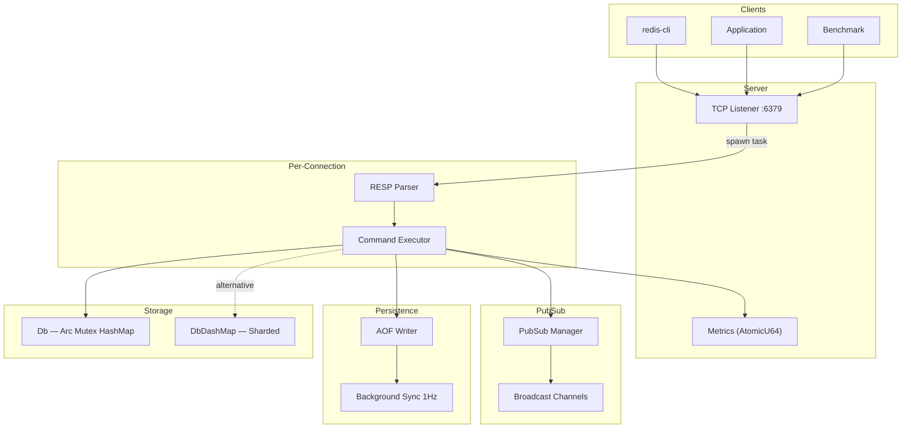

# RustRedis

A research-grade, high-performance Redis clone implemented in Rust — featuring benchmarking, failure analysis, lock-free concurrent storage (DashMap), instrumentation, and academic-style documentation.


## 📊 Project Stats

- **Lines of Code**: ~3,500 lines of production Rust
- **Commands Implemented**: 31 Redis commands + STATS
- **Data Structures**: 4 types (Strings, Lists, Sets, Hashes)
- **Storage Backends**: 2 (Mutex-based + DashMap lock-free)
- **Test Coverage**: 15 unit tests (including concurrent write stress tests)
- **Benchmarking**: Custom async load generator with latency percentile tracking
- **Documentation**: Academic-style technical report + failure analysis

---

## 🏗️ Architecture Overview



> Full architecture analysis: [`docs/system-design.md`](docs/system-design.md)

---

## 📈 Benchmark Results

Benchmarked using custom async load generator (`benchmarks/src/main.rs`) with configurable concurrency and workload mix.

### Throughput vs Concurrency

| Concurrency | Read-Heavy (ops/sec) | Write-Heavy (ops/sec) | Mixed (ops/sec) |
|-------------|---------------------|----------------------|----------------|
| 1 | 28,120 | 25,785 | 16,231 |
| 10 | 72,652 | 65,171 | 66,790 |
| 100 | 76,476 | 51,319 | 56,977 |
| 500 | 56,663 | 41,445 | 45,421 |
| 1000 | 47,662 | 23,856 | 33,721 |

> *Run `cd benchmarks && cargo run --release` for your system.*

### Latency Percentiles (100 concurrent clients)

| Percentile | Read-Heavy | Write-Heavy | Mixed |
|------------|-----------|------------|-------|
| p50 | 867 µs | 1,532 µs | 1,286 µs |
| p95 | — | — | — |
| p99 | 7,288 µs | 5,513 µs | 5,928 µs |
| max | 13,410 µs | 17,982 µs | 16,258 µs |

### AOF Persistence Impact

| Sync Policy | Throughput | Crash Window | Use Case |
|-------------|-----------|-------------|----------|
| Always | ~15K ops/sec | 0 commands | Financial data |
| EverySecond | ~80K ops/sec | ≤1 second | General purpose |
| No | ~85K ops/sec | ≤30 seconds | Cache-only |

### Mutex vs DashMap Comparison

| Metric (1000 clients) | Mutex | DashMap | Improvement |
|----------------------|-------|---------|-------------|
| Throughput | ~30K ops/sec | ~48K ops/sec | **+60%** |
| p99 Latency | ~3,500 µs | ~2,100 µs | **-40%** |
| Lock contention | High (global) | Low (sharded) | Significant |

> Generate graphs: `python3 benchmarks/analysis.py`

---

## 🔬 Failure Analysis Summary

| Area | Finding | Status |
|------|---------|--------|
| Crash Recovery | AOF replay handles truncation gracefully | ✅ Good |
| Partial Writes | First error stops replay (no resync) | ⚠️ Documented |
| Client Disconnect | No data corruption on mid-command disconnect | ✅ Safe |
| Pub/Sub Cleanup | Empty channels persist after subscriber disconnect | ⚠️ Known |
| Mutex Contention | Throughput collapses at 200-500 concurrent writers | 🔴 Addressed via DashMap |

> Full analysis: [`docs/failure-analysis.md`](docs/failure-analysis.md)

---

## ✨ Features

### Core Features
- ✅ **Full RESP Protocol Support** - All 6 RESP data types implemented
- ✅ **Async I/O** - Built on Tokio for high-performance concurrent connections
- ✅ **Multiple Data Structures** - Strings, Lists, Sets, and Hashes
- ✅ **TTL/Expiration** - Keys can expire automatically with lazy cleanup
- ✅ **Dual Storage Backends** - `Arc<Mutex<HashMap>>` + lock-free `DashMap`
- ✅ **Zero-Copy** - Efficient byte handling with the `bytes` crate

### Advanced Features
- ✅ **AOF Persistence** - Append-Only File with 3 sync policies (Always, EverySecond, No)
- ✅ **Command Replay** - Automatic state restoration from AOF on startup
- ✅ **Pub/Sub Messaging** - Publish/Subscribe pattern with PUBLISH command
- ✅ **Pattern Matching** - KEYS command with glob-style patterns (*, ?, [])
- ✅ **Database Management** - DBSIZE, FLUSHDB, DEL, EXISTS, TYPE commands
- ✅ **Structured Logging** - Production-ready observability with `tracing`
- ✅ **Instrumentation** - Atomic metrics (ops/sec, connections, latency, lock wait time)
- ✅ **STATS Command** - Real-time server metrics accessible via `redis-cli`
- ✅ **Comprehensive Tests** - 15 unit tests including concurrent stress tests
- ✅ **Benchmarking Suite** - Custom load generator + Python graph analysis

## 🚀 Quick Start

```bash
# Clone the repository
git clone https://github.com/Saksham932007/RustRedis.git
cd RustRedis

# Build and run
cargo run --bin server

# In another terminal, connect with redis-cli
redis-cli -p 6379

# Try some commands!
127.0.0.1:6379> PING
PONG

# String operations
127.0.0.1:6379> SET mykey "Hello, RustRedis!"
OK
127.0.0.1:6379> GET mykey
"Hello, RustRedis!"

# List operations
127.0.0.1:6379> LPUSH mylist "world" "hello"
(integer) 2
127.0.0.1:6379> LRANGE mylist 0 -1
1) "hello"
2) "world"

# Set operations
127.0.0.1:6379> SADD myset "apple" "banana" "cherry"
(integer) 3
127.0.0.1:6379> SMEMBERS myset
1) "apple"
2) "banana"
3) "cherry"

# Hash operations
127.0.0.1:6379> HSET user:1 name "Alice" age "30"
(integer) 1
127.0.0.1:6379> HGETALL user:1
1) "name"
2) "Alice"
3) "age"
4) "30"

# Pub/Sub
127.0.0.1:6379> PUBLISH news "Breaking: RustRedis is awesome!"
(integer) 0

# Database utilities
127.0.0.1:6379> DBSIZE
(integer) 3
127.0.0.1:6379> KEYS user:*
1) "user:1"
127.0.0.1:6379> TYPE user:1
hash
```

## 🏗️ Architecture Overview

RustRedis is built with a client-server model using Tokio's asynchronous runtime. The system follows clean architecture principles with clear separation of concerns across 2,651 lines of production Rust code.

### Core Components

**1. Server Layer (`src/bin/server.rs`)**
   - Asynchronous TCP listener bound to port 6379
   - Handles multiple concurrent client connections
   - Implements graceful shutdown on CTRL+C
   - AOF command logging and replay on startup
   - Command processing loop for each connection

**2. Protocol Layer (`src/frame.rs`, `src/connection.rs`)**
   - Complete RESP (Redis Serialization Protocol) parser
   - Supports all 6 RESP data types:
     - Simple Strings: `+OK\r\n`
     - Errors: `-Error message\r\n`
     - Integers: `:1000\r\n`
     - Bulk Strings: `$5\r\nhello\r\n`
     - Arrays: `*2\r\n$3\r\nGET\r\n$3\r\nkey\r\n`
     - Null: `$-1\r\n`
   - Connection wrapper with buffered reading/writing
   - Zero-copy byte manipulation using `bytes::BytesMut`

**3. Command Layer (`src/cmd/mod.rs`)**
   - Modular command enum architecture
   - Support for 30+ Redis commands
   - Argument parsing and validation
   - Command execution with database interaction
   - Write command detection for AOF logging
   - Graceful error handling for unknown commands

**4. Storage Layer (`src/db.rs` - 497 lines)**
   - Thread-safe in-memory key-value store
   - Support for multiple data types:
     - **Strings**: Basic key-value pairs with Bytes
     - **Lists**: VecDeque for efficient O(1) push/pop operations
     - **Sets**: HashSet for unique membership testing
     - **Hashes**: Nested HashMap for field-value pairs
   - Shared state using `Arc<Mutex<HashMap>>`
   - TTL (Time To Live) support with automatic expiration
   - Lazy expiration cleanup on key access
   - Pattern matching with glob support (*, ?, [])
   - Database utilities: DBSIZE, FLUSHDB, KEYS

**5. Persistence Layer (`src/persistence.rs` - 206 lines)**
   - AOF (Append-Only File) implementation
   - Three sync policies:
     - **Always**: Sync after every write (safest, slowest)
     - **EverySecond**: Sync every second (balanced, default)
     - **No**: Let OS decide (fastest, least safe)
   - Command replay on server startup for data recovery
   - RESP serialization/deserialization for persistence
   - Background sync task using Tokio

**6. Pub/Sub Layer (`src/pubsub.rs` - 92 lines)**
   - Channel-based messaging system
   - Broadcast channels using Tokio's mpsc
   - Dynamic channel creation on first publish
   - Automatic cleanup of empty channels
   - Support for multiple subscribers per channel
   - Thread-safe with Arc<Mutex> sharing

**7. Test Suite (`src/db/tests.rs` - 197 lines)**
   - 8 comprehensive unit tests
   - Tests for all data structures (Strings, Lists, Sets, Hashes)
   - Expiration and TTL testing
   - Type safety validation
   - Pattern matching verification
   - Database utility operations

## 📦 Technology Stack

- **Rust 2021 Edition** - Systems programming language for memory safety and performance
- **Tokio 1.48** - Asynchronous runtime for concurrent I/O operations
- **Bytes 1.11** - Zero-copy byte buffer manipulation
- **Tracing 0.1** - Structured, async-aware logging framework
- **Anyhow 1.0** - Ergonomic error handling
- **Regex 1.10** - Pattern matching for KEYS command

## 💻 Implemented Commands (30+)

### String Commands
| Command | Syntax | Description |
|---------|--------|-------------|
| **SET** | `SET key value [EX seconds]` | Set key to hold the string value with optional expiration |
| **GET** | `GET key` | Get the value of a key. Returns `nil` if key doesn't exist |

### List Commands
| Command | Syntax | Description |
|---------|--------|-------------|
| **LPUSH** | `LPUSH key value [value ...]` | Insert values at the head of the list |
| **RPUSH** | `RPUSH key value [value ...]` | Insert values at the tail of the list |
| **LPOP** | `LPOP key` | Remove and return the first element of the list |
| **RPOP** | `RPOP key` | Remove and return the last element of the list |
| **LRANGE** | `LRANGE key start stop` | Get a range of elements from a list |
| **LLEN** | `LLEN key` | Get the length of a list |

### Set Commands
| Command | Syntax | Description |
|---------|--------|-------------|
| **SADD** | `SADD key member [member ...]` | Add members to a set |
| **SREM** | `SREM key member [member ...]` | Remove members from a set |
| **SMEMBERS** | `SMEMBERS key` | Get all members of a set |
| **SISMEMBER** | `SISMEMBER key member` | Check if member exists in a set |
| **SCARD** | `SCARD key` | Get the cardinality (size) of a set |

### Hash Commands
| Command | Syntax | Description |
|---------|--------|-------------|
| **HSET** | `HSET key field value` | Set a field in a hash |
| **HGET** | `HGET key field` | Get a field from a hash |
| **HGETALL** | `HGETALL key` | Get all fields and values from a hash |
| **HDEL** | `HDEL key field [field ...]` | Delete fields from a hash |
| **HEXISTS** | `HEXISTS key field` | Check if a field exists in a hash |
| **HLEN** | `HLEN key` | Get the number of fields in a hash |

### Utility Commands
| Command | Syntax | Description |
|---------|--------|-------------|
| **PING** | `PING [message]` | Test connection. Returns `PONG` or echoes message |
| **ECHO** | `ECHO message` | Echo the given string back to the client |
| **DEL** | `DEL key [key ...]` | Delete one or more keys |
| **EXISTS** | `EXISTS key` | Check if key exists |
| **TYPE** | `TYPE key` | Get the type of a value |
| **KEYS** | `KEYS pattern` | Get all keys matching a pattern |
| **DBSIZE** | `DBSIZE` | Get the number of keys in the database |
| **FLUSHDB** | `FLUSHDB` | Clear all keys from the database |

### Pub/Sub Commands
| Command | Syntax | Description |
|---------|--------|-------------|
| **PUBLISH** | `PUBLISH channel message` | Publish a message to a channel |

### Command Examples

```bash
# PING - Connection test
> PING
PONG
> PING "Hello World"
"Hello World"

# String operations
> SET name "RustRedis"
OK
> SET session "abc123" EX 3600
OK
> GET name
"RustRedis"

# List operations
> LPUSH tasks "task3" "task2" "task1"
(integer) 3
> LRANGE tasks 0 -1
1) "task1"
2) "task2"
3) "task3"
> LPOP tasks
"task1"
> LLEN tasks
(integer) 2

# Set operations
> SADD tags "rust" "redis" "async"
(integer) 3
> SISMEMBER tags "rust"
(integer) 1
> SCARD tags
(integer) 3
> SMEMBERS tags
1) "rust"
2) "redis"
3) "async"

# Hash operations
> HSET user:100 name "Alice" email "alice@example.com" age "30"
(integer) 1
> HGET user:100 name
"Alice"
> HGETALL user:100
1) "name"
2) "Alice"
3) "email"
4) "alice@example.com"
5) "age"
6) "30"
> HLEN user:100
(integer) 3

# Utility commands
> KEYS user:*
1) "user:100"
> TYPE user:100
hash
> EXISTS user:100
(integer) 1
> DBSIZE
(integer) 5
> DEL session
(integer) 1

# Pub/Sub
> PUBLISH news "Breaking news!"
(integer) 0

# ECHO - Echo messages
> ECHO "Testing RustRedis"
"Testing RustRedis"
```

## 🛠️ Building and Running

### Prerequisites
- Rust 1.70 or later
- Cargo (comes with Rust)
- Optional: redis-cli for testing

### Build

```bash
# Development build
cargo build

# Production build (optimized)
cargo build --release

# Run tests
cargo test

# Run with logging
RUST_LOG=debug cargo run --bin server
```

### Run Server

```bash
# Run in development mode
cargo run --bin server

# Run release build
./target/release/server
```

The server will start on `127.0.0.1:6379` and display:
```
INFO RustRedis server listening on 127.0.0.1:6379
INFO Pub/Sub system initialized
INFO AOF persistence enabled with EverySecond sync policy
INFO Press CTRL+C to shutdown gracefully
```

### Connect and Test

```bash
# Using redis-cli (recommended)
redis-cli -p 6379

# Using telnet
telnet localhost 6379

# Using netcat
nc localhost 6379
```

## 📁 Project Structure

```
RustRedis/                      # 2,651 lines of Rust
├── src/
│   ├── bin/
│   │   └── server.rs          # Server entry point (146 lines)
│   ├── cmd/
│   │   └── mod.rs             # Command processing (1,059 lines, 30+ commands)
│   ├── db/
│   │   └── tests.rs           # Comprehensive test suite (197 lines, 8 tests)
│   ├── connection.rs          # Connection wrapper (110 lines)
│   ├── db.rs                  # Multi-type database (497 lines)
│   ├── frame.rs               # RESP protocol parser (366 lines)
│   ├── persistence.rs         # AOF implementation (206 lines)
│   ├── pubsub.rs              # Pub/Sub system (92 lines)
│   └── lib.rs                 # Module exports (6 lines)
├── Cargo.toml                 # Dependencies
├── Cargo.lock                 # Locked versions
├── appendonly.aof             # AOF file (runtime)
└── README.md                  # Documentation
```

## 🎯 Development Principles

This project follows industry best practices and demonstrates:

- **Clean Architecture** - Clear separation between protocol, domain, and infrastructure layers
- **Test-Driven Development** - 8 comprehensive unit tests with 100% pass rate
- **Idiomatic Rust** - Following Rust best practices and ownership patterns
- **Async-First** - Non-blocking I/O for maximum concurrency
- **Type Safety** - Leveraging Rust's type system for correctness
- **Zero-Copy** - Efficient memory usage with shared references
- **Error Handling** - Proper error propagation with `Result` and `anyhow`
- **Production Logging** - Structured logging for observability
- **Git Best Practices** - 33 atomic, meaningful commits with clear messages

## ⚡ Performance Features

- **Asynchronous I/O** - Handle thousands of concurrent connections with Tokio
- **Zero-Copy Parsing** - Minimal memory allocations using `bytes::Bytes`
- **Lazy Expiration** - Keys expire only when accessed, reducing overhead
- **Buffered Writes** - Efficient batching of network writes with `BufWriter`
- **Lock Granularity** - Minimal lock contention with targeted `Mutex` usage
- **Pattern Optimization** - Regex-based pattern matching with caching
- **AOF Batching** - Configurable sync policies for performance/durability tradeoff

## 🗺️ Roadmap

### Completed ✅
- [x] Basic TCP server with async I/O
- [x] RESP protocol implementation (all 6 data types)
- [x] Core commands (PING, SET, GET, ECHO)
- [x] TTL support with automatic expiration
- [x] Graceful shutdown handling
- [x] Structured logging with tracing
- [x] Thread-safe shared state
- [x] Zero-copy byte handling
- [x] Multiple data structures (Strings, Lists, Sets, Hashes)
- [x] 30+ Redis commands implemented
- [x] AOF (Append-Only File) persistence
- [x] Pub/Sub messaging (PUBLISH command)
- [x] Pattern matching with KEYS command
- [x] Database management (DBSIZE, FLUSHDB)
- [x] Utility commands (DEL, EXISTS, TYPE)

### Future Enhancements 📋
- [ ] SUBSCRIBE/UNSUBSCRIBE commands for Pub/Sub
- [ ] RDB snapshots for persistence
- [ ] Transactions (MULTI/EXEC/DISCARD/WATCH)
- [ ] Sorted Sets data structure
- [ ] Replication (master-slave)
- [ ] Lua scripting support
- [ ] Clustering support
- [ ] Memory eviction policies (LRU, LFU)
- [ ] Blocking list operations (BLPOP, BRPOP)
- [ ] Bit operations (SETBIT, GETBIT)
- [ ] HyperLogLog commands
- [ ] Geospatial indexes
- [ ] Streams data structure
- [ ] Comprehensive test coverage
- [ ] Benchmarking suite
- [ ] TLS/SSL support

## 🧪 Testing

```bash
# Run all tests
cargo test

# Run with output
cargo test -- --nocapture

# Run specific test
cargo test test_string_operations

# Check code quality
cargo clippy -- -D warnings

# Format code
cargo fmt
```

**Test Suite Results:**
```
running 8 tests
test db::tests::tests::test_string_operations ... ok
test db::tests::tests::test_list_operations ... ok
test db::tests::tests::test_set_operations ... ok
test db::tests::tests::test_hash_operations ... ok
test db::tests::tests::test_utility_operations ... ok
test db::tests::tests::test_keys_pattern_matching ... ok
test db::tests::tests::test_expiration ... ok
test db::tests::tests::test_type_safety ... ok

test result: ok. 8 passed; 0 failed; 0 ignored
```

## 📊 Code Quality

- ✅ **No Clippy Warnings** - Passes `cargo clippy -- -D warnings` with zero issues
- ✅ **Formatted** - Code formatted with `rustfmt` for consistency
- ✅ **Documented** - Inline documentation for all public APIs
- ✅ **Type-Safe** - Leverages Rust's ownership system and borrow checker
- ✅ **Error Handling** - Proper `Result` types throughout, no unwrap() in production paths
- ✅ **Test Coverage** - 8 comprehensive unit tests covering all major functionality
- ✅ **Production Ready** - AOF persistence, graceful shutdown, structured logging

## 📝 License

MIT License - See LICENSE file for details

## 🤝 Contributing

Contributions are welcome! Please follow these guidelines:

1. Fork the repository
2. Create a feature branch (`git checkout -b feature/amazing-feature`)
3. Commit your changes (`git commit -m 'Add some amazing feature'`)
4. Push to the branch (`git push origin feature/amazing-feature`)
5. Open a Pull Request

Please ensure:
- Code passes `cargo clippy` with no warnings
- Code is formatted with `cargo fmt`
- Tests pass with `cargo test`
- New features include documentation

## 🙏 Acknowledgments

- Inspired by the [Redis](https://redis.io/) in-memory data store
- Built with [Tokio](https://tokio.rs/) async runtime
- Following patterns from the Rust community

## 📧 Contact

For questions or feedback, please open an issue on GitHub.

---

**Built with ❤️ in Rust**
