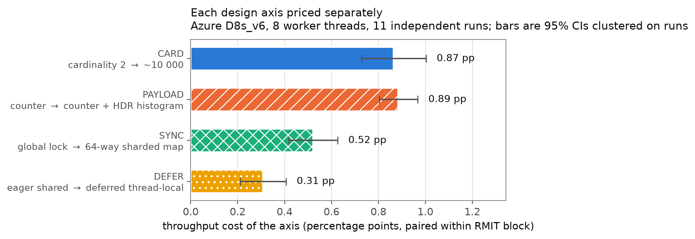
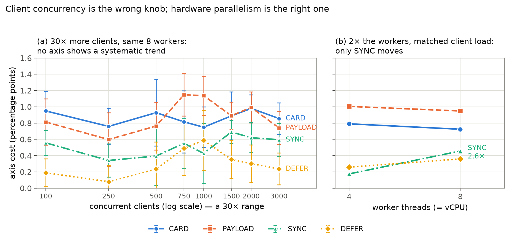
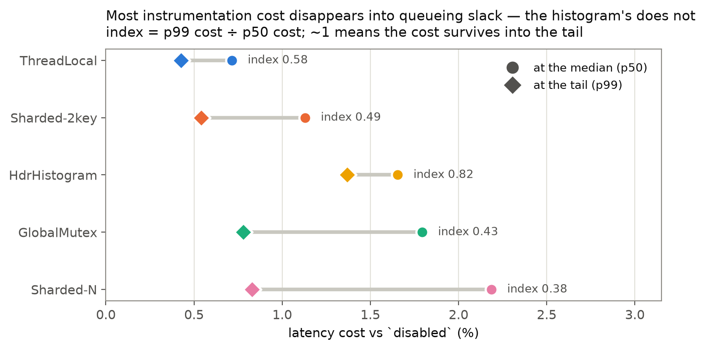
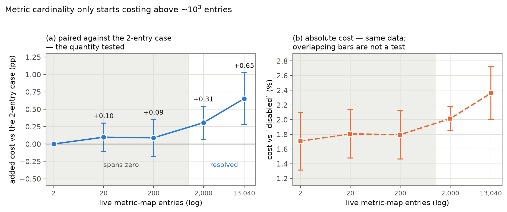

# Cardinality Before Contention: A Factorial Decomposition of Per-Command Observability Overhead in a Concurrent In-Memory Key-Value Store

**Saksham Kapoor**
Delhi, India
`sakshamkapoor810@gmail.com`

*Manuscript prepared for a performance-engineering venue (e.g. ACM/SPEC ICPE,
Empirical Software Engineering, or Performance Evaluation). Reference style,
section numbering, and length are to be converted to the target venue's
template at submission; the content below is venue-neutral. Every table,
figure, and quoted statistic regenerates from committed artifacts via
`scripts/analyze_design_axes.py` and `scripts/generate_design_axes_figures.py`
(Appendix A).*

---

## Abstract

Engineering folklore treats the cost of per-operation telemetry as a
synchronization problem: the advice is to replace the global counter lock with
a sharded or lock-free structure. We show that on a network-bound, thread-pool
concurrent server this advice optimizes the smaller of two costs. We instrument
a Rust Redis-compatible in-memory key-value store with six interchangeable
per-command metrics collectors chosen so that adjacent pairs differ along
exactly one design axis — synchronization discipline, metric key cardinality,
aggregation locality, and per-sample payload — turning a strategy comparison
into a factorial decomposition. Measurements use Randomized Multiple
Interleaved Trials, repeated as eleven independent runs across five separately
provisioned Azure `Standard_D8s_v6` VMs in three regions, plus one
`Standard_D4s_v6` VM (25,200 benchmark runs; 100–3000 concurrent clients; three
read/write mixes), with all confidence intervals clustered on the independent
runs rather than on the correlated blocks they contain. A second, dedicated
eight-VM experiment (4,320 further runs) separates the two axes that the main
design bundles, for 29,520 benchmark runs in all.

Four results follow. **(1)** Moving the metric key from a 2-entry command-name
label to a ~10,000-entry data-key label costs 0.87 pp of throughput, 1.66×
more than the 0.52 pp that replacing a global mutex with a 64-way sharded
concurrent map saves (difference 0.34 pp, 95% CI [0.19, 0.50], 10/11 runs,
sign p = 0.012). The practical consequence is an inversion of the folklore: the
sharded "scalable" map at high cardinality is *measurably slower* than the
single global lock at low cardinality. **(2)** The axes obey different scaling
laws. Over a 30× increase in client concurrency no axis shows a trend
distinguishable from zero (largest slope 0.041 pp per doubling, CI spanning
zero), even though the server is genuinely saturated (p99 rises from 0.76 ms to
78.9 ms). The synchronization axis instead tracks *worker-thread* count,
growing 2.6× from 4 to 8 workers while the cardinality and payload axes move
−8% and −6%. Client load, the knob benchmarks usually turn, is the wrong one
for exposing telemetry contention. **(3)** Overhead is not one number: it has a
*rigidity* that depends on the axis. Counter-based costs are elastic — absorbed
by queueing slack, retaining only 38–58% of their median cost at p99 — whereas
the histogram payload cost is rigid, statistically identical across throughput,
mean, p50, and p99 (0.89–0.94 pp). This produces a rank inversion invisible to
throughput-only evaluation: HdrHistogram versus GlobalMutex is unresolved on
throughput (p = 0.23) yet resolves decisively in *opposite directions* at p50
(cheaper, p = 0.001) and p99 (costlier, p = 0.001). **(4)** A purpose-built
instrument — a collector whose per-operation work is identical at every
cardinality, so that sweeping it varies only the number of live map entries —
confirms that the cardinality axis is genuinely cardinality rather than the
per-operation key allocation bundled with it (entry count accounts for
essentially all of it; the histogram likewise accounts for ~80% of the payload
axis). The same experiment bounds the claim: the effect is indistinguishable
from zero below roughly 10³ entries, and cardinality *alone* does not
statistically outrank the synchronization axis, so we make the package claim
in (1) and not the stronger one.

We argue that observability overhead should be budgeted per design axis and per
target percentile, not as a single headline percentage, and we give the
measurement design needed to do so.

**Keywords:** performance measurement, observability, instrumentation overhead,
metric cardinality, tail latency, concurrency, key-value stores, randomized
interleaved trials, cloud benchmarking

**CCS Concepts:** • *General and reference* → *Measurement; Performance*;
• *Software and its engineering* → *Software performance*;
• *Information systems* → *Key-value stores*.

---

## 1. Introduction

Every production server carries telemetry, and every telemetry design makes a
choice about how counters are stored and updated on the request path. The
received wisdom about that choice is remarkably uniform. Practitioner guidance
converges on "keep the hot path lock-free": hold a per-metric atomic handle,
shard the counter map, or accumulate per-thread and merge later. The
implicit model is that instrumentation overhead is *contention* overhead, and
that contention grows with load.

This paper tests that model and finds it misleading in two separate ways on a
class of system where it is routinely applied: a single-process, network-bound,
thread-pool concurrent in-memory key-value store.

The difficulty in testing it is that "which metrics strategy is fastest" is the
wrong question, because a strategy is a bundle of decisions. A thread-local
histogram collector differs from a global-mutex counter in *at least* four ways
at once — where the synchronization happens, how many distinct counter entries
exist, whether aggregation is eager or deferred, and how much work each sample
costs — so a ranking of strategies tells an engineer nothing about which of
those decisions to revisit. We therefore choose the six collectors so that
adjacent pairs differ along exactly one axis, which converts a strategy
comparison into a factorial decomposition and lets each axis be priced
separately (§3).

Pricing them separately is what produces the paper's main result. The axis
practitioners are told to optimize — synchronization discipline — is worth
0.52 percentage points of throughput on 8 worker threads. The axis they are
told to worry about only for *storage* cost — metric key cardinality — is worth
0.87 pp, 1.66× more. Because those two numbers are differences against a common
reference, their gap is algebraically identical to the direct comparison
between the two strategies: a 64-way sharded concurrent map keyed by a
high-cardinality label is 0.34 pp *slower* than a single global mutex keyed by
a low-cardinality one. Replacing the lock while leaving the label alone is a
net loss.

High metric cardinality is a well-known problem, but the literature and the
practitioner writing we surveyed frame it almost exclusively as a
*backend* cost — time-series database memory, index size, query CPU, and
per-series billing. We found no controlled measurement of cardinality as a
*server-side request-path throughput* cost, and none comparing it head-to-head
against the synchronization cost that the same audience is told to prioritize.

Two further results follow from the same design. Neither the cardinality nor
the payload axis responds to client concurrency at all over a 30× range,
while the synchronization axis responds to *worker-thread* count instead — so
the standard practice of "turn up the client count until contention shows"
cannot, even in principle, expose these costs on a thread-pool server, because
the number of threads able to touch the counter structure is bounded by the
pool, not by the client population (§5.2). And overhead turns out to have a
*rigidity* that differs by axis: most instrumentation cost is elastic and
vanishes into queueing slack at the tail, but histogram-payload cost is rigid
and arrives undiminished at p99, which inverts the cost ranking between
percentiles and makes throughput-only evaluation actively misleading (§5.3).

### 1.1 Contributions

1. **A factorial decomposition of per-command observability overhead into four
   separately-priced design axes** (§3, §5.1), rather than a ranking of
   strategy bundles, with an explicit account of what each contrast does and
   does not isolate (§3.3).
2. **The cardinality-dominance result** (§5.1): high-cardinality dynamic
   labeling costs 1.66× what the entire global-lock-to-sharded-map transition
   saves, inverting the usual optimization priority, and reproducing on both VM
   sizes (4.5× at 4 workers, 1.66× at 8). A dedicated eight-VM experiment
   (§5.4) shows the effect is cardinality itself and not the key allocation
   bundled with it, and bounds where it applies: below ~10³ entries it is
   indistinguishable from zero.
3. **A scaling-law separation** (§5.2): telemetry axes are invariant to client
   concurrency over a 30× range on a saturated server, while the
   synchronization axis tracks worker-thread count — with the methodological
   consequence that client load is the wrong experimental knob.
4. **Overhead rigidity and the percentile-dependent rank inversion** (§5.3):
   a tail-concentration index separating elastic from rigid costs, and a
   demonstration that a comparison reported as statistically unresolved under a
   throughput budget resolves in opposite directions at p50 and p99.
5. **An instrument for pricing metric cardinality in isolation** (§5.4): a
   collector that holds per-operation work byte-for-byte constant while the
   live entry count sweeps 3.5 decades, which is a cleaner control than
   sweeping the workload key space (that would vary the request distribution
   too). It is reusable by anyone asking the same question of another system.
6. **A reproducible measurement design and artifact** (§4, Appendix A):
   29,520 RMIT runs over fourteen cloud VMs, cluster-aware inference, and
   committed scripts that regenerate every number in the paper.

---

## 2. Background and Related Work

**Instrumentation overhead.** That measurement perturbs what it measures is
long established; Tallent et al. [18] show it specifically for lock-contention
tooling, and production tracing systems bound their own cost by sampling
precisely because it is not negligible [17]. Recent empirical work prices
whole instrumentation *frameworks*: studies of OpenTelemetry and comparable
agents report CPU overheads in the tens of percent and throughput losses up to
roughly 8% in aggregate. These studies answer "what does turning on this
framework cost?" They do not decompose that cost into the design decisions
that produced it, which is the gap this paper addresses.

**Metric cardinality.** Cardinality is one of the most discussed operational
problems in modern monitoring, but essentially always as a *storage-side*
concern: each distinct label combination creates a time series with memory,
disk, index, and billing cost. The remedy offered is bounded-cardinality
labels, for backend reasons. The *producer-side* request-path cost of a
high-cardinality label — the extra work the server itself does per operation —
is, to our knowledge, not measured in a controlled setting, and never compared
against the synchronization cost it is traded against in practice.

**Concurrent counting.** The structures we compare descend from a long line of
work on reducing counter contention: counting networks [3], the per-core
"sloppy counters" that removed kernel counter bottlenecks in Linux [4], and
the general replacement of coarse locks with concurrency-friendly structures
that lifted Memcached throughput in MemC3 [9]. David et al. [8] establish that
synchronization cost is strongly hardware-dependent, which is the premise
behind our worker-count comparison in §5.2. This literature is the source of
the folklore we test: it is correct that sharded and per-thread counting
reduce contention, and our SYNC axis confirms it. The finding here is about
*relative magnitude* — that the contention saved is smaller than the
cardinality cost typically incurred alongside it.

**Benchmarking methodology.** Measured performance depends on setup details
experimenters rarely control [15], so rigorous practice reports intervals over
repeated runs [11, 12] and randomizes factors that should not matter [7].
Cloud environments add time-varying noise in compute [14] and network [20].
Randomized Multiple Interleaved Trials (RMIT) was introduced by Abedi, Heard
and Brecht [2] and shown necessary in clouds by Abedi and Brecht [1], who found
differences up to 37.8% between two *identical* systems under non-randomized
designs. Duet benchmarking [5] instead runs artifacts simultaneously, which
does not suit a saturating client-server benchmark where two server instances
would contend. Laaber et al. [13] combine RMIT-style sampling, bootstrap
intervals, A/A tests, and injected-slowdown detectability analysis for cloud
microbenchmarks, and explicitly disclaim load and stress tests. We adopt RMIT
and their inferential posture; the technique is theirs, not ours. Our
methodological addition is narrower and specific to pooled replicates:
inference clustered on independent VM runs rather than on the correlated blocks
within them (§4.3). For key-value systems YCSB [6] is the standard suite and
Reniers et al. [16] survey under-reporting in NoSQL benchmarking; Fruth et
al. [10] show harnesses themselves distorting measured tail latency, which is
part of why §5.3 reports tail results as *relative* paired ratios against a
baseline measured by the same harness.

**Positioning.** RMIT, bootstrap intervals, and detectability analysis are
prior art. What is new here is the factorial decomposition of telemetry
overhead into separately-priced axes, the finding that the cardinality axis
dominates the synchronization axis, the separation of client-concurrency from
worker-count scaling, and the percentile-dependent rigidity result.

---

## 3. System Under Study and the Factorial Design

### 3.1 The server

RustRedis is a Redis-compatible in-memory key-value server in Rust
(~3,500 LOC). A Tokio multi-threaded runtime accepts TCP connections, one task
per connection; tasks parse RESP frames and execute against shared state. The
runtime is configured with `flavor = "multi_thread"` and default worker count,
so **the number of OS threads that can concurrently enter the metrics path
equals the vCPU count** — 8 on `Standard_D8s_v6`, 4 on `Standard_D4s_v6` —
regardless of how many clients are connected. This property is what §5.2
exploits.

On every command the server records the command name, an optional borrowed key
hint, and the execution duration, then calls the active collector. Crucially,
the timing itself (`Instant::now()`, `elapsed()`) and the key-hint lookup run
identically for *all* strategies **including the `disabled` baseline**, so
those costs cancel in the paired comparison. The only thing that varies is the
body of `record()`.

### 3.2 The six collectors as a factorial design

The collectors (`src/command_metrics.rs`) are selected so that adjacent pairs
differ along one axis:

| Strategy | Synchronization | Cardinality | Aggregation | Payload |
|---|---|---:|---|---|
| `disabled` | — | 0 | — | — |
| `global_mutex` | one global `Mutex<HashMap>` | 2 | eager, shared | counter |
| `sharded_2key` | `DashMap`, 64 shards | 2 | eager, shared | counter |
| `sharded_n` | `DashMap`, 64 shards | ~10,000 | eager, shared | counter |
| `thread_local` | thread-local map + periodic flush | 2 | deferred, private | counter |
| `hdr_histogram` | thread-local map + periodic flush | 2 | deferred, private | counter + HDR histogram |

Cardinality 2 means the metric is keyed by command name (`GET`, `SET`);
cardinality ~10,000 means it is keyed by the request's data key, over a
10,000-key workload — the direct analogue of a high-cardinality label such as
`user_id` in a production metric. This yields four contrasts:

| Axis | Contrast | Question it prices |
|---|---|---|
| **SYNC** | `global_mutex` − `sharded_2key` | What does a global lock cost versus a 64-way sharded map? |
| **CARD** | `sharded_n` − `sharded_2key` | What does high-cardinality dynamic labeling cost? |
| **DEFER** | `sharded_2key` − `thread_local` | What does eager shared aggregation cost versus deferred thread-local? |
| **PAYLOAD** | `hdr_histogram` − `thread_local` | What does a latency histogram cost versus a plain counter? |

Because all four are differences against a shared reference, arbitrary
strategy comparisons are recoverable by arithmetic. In particular
**CARD − SYNC is algebraically identical to `sharded_n` − `global_mutex`**,
which is why §5.1's headline has a direct physical reading.

### 3.3 What each contrast does and does not isolate

Isolating one axis per contrast is the design intent; the implementation is not
perfectly clean, and we state the residual differences explicitly because two
of them bear on the headline claim.

- **SYNC is contaminated against our own hypothesis.** `global_mutex`
  additionally instruments *itself*: it brackets the lock acquisition with two
  `Instant` reads and accumulates the wait into a shared `AtomicU64` on every
  operation. That atomic is a single contended cache line, and it is work the
  other five strategies do not perform. The measured SYNC penalty therefore
  **overstates** the cost of the global lock as such. Since our claim is that
  SYNC is *smaller* than CARD, this confound biases against the claim, and the
  claim survives it — the true gap is if anything wider than reported. We
  report the measured value and treat it as a conservative upper bound on the
  synchronization axis.
- **CARD bundles cardinality with owned-key allocation — and §5.4 separates
  them.** `sharded_n` keys its map by an owned `String`, allocated per
  operation, whereas `sharded_2key` uses a `&'static str`. As specified, the
  contrast therefore prices "labeling by a high-cardinality dynamic value" as a
  package — map growth to ~10,000 entries *plus* the per-operation key
  materialization that such labeling requires. That package is the practically
  relevant quantity, since a dynamic label in a real system (a user ID, a
  route, a tenant) must be materialized on every operation too. But the
  attribution between the two components mattered enough to measure directly,
  and §5.4 reports a dedicated eight-run experiment that does so: the entry
  count accounts for essentially all of CARD. The axis is cardinality, not an
  allocation artifact.
- **PAYLOAD shares that allocation term — and §5.4 separates it too.**
  `hdr_histogram` also keys by an owned `String` while `thread_local` uses
  `&'static str`, so PAYLOAD as specified prices the histogram *plus* the same
  key materialization. Its cardinality is 2, so no map-growth component is
  involved. §5.4 finds roughly 80% of PAYLOAD is the histogram itself.
- **DEFER is close to clean.** Both sides use `&'static str` keys at
  cardinality 2. `thread_local` additionally increments a shared atomic
  flush counter per operation and performs a periodic batch push, which is
  intrinsic to deferred aggregation rather than incidental to it.

Two axes (SYNC, DEFER) are therefore clean-to-conservative, and two (CARD,
PAYLOAD) price a coherent package that includes a shared allocation term. §5.4
decomposes that package with a separate experiment and finds the package is
dominated by the axis it is named for in both cases.

---

## 4. Experimental Methodology

### 4.1 Design

Throughput on lightly controlled machines drifts over a run, so a blocked
design would confound strategy with machine state [1]. We use RMIT: each
repetition ("block") runs every (strategy, concurrency, workload) configuration
exactly once in a fresh independent random permutation, and the server is
restarted before every run. A machine-state snapshot (CPU frequency, governor,
thermal zone, memory, swap, load average) is logged immediately before each run.

All overhead figures are **paired within-block ratios** against the `disabled`
baseline in the same block. This is the comparison RMIT makes valid: every
strategy in a block met the same machine conditions, so a condition that slowed
the block slows numerator and denominator alike.

### 4.2 Datasets

| Dataset | Hardware | Design | Runs |
|---|---|---|---:|
| `azure_d4s_v6` | `Standard_D4s_v6`, 4 vCPU / 16 GB, Central India | 6 strategies × 8 concurrency (100–1000) × 30 blocks, mixed workload | 1,440 |
| `azure_d8s_v6` (pooled) | `Standard_D8s_v6`, 8 vCPU / 32 GB, 5 VMs across 3 regions | 6 strategies × 8 concurrency (100–3000) × 3 workloads × 15 blocks, **× 11 independent runs** | 23,760 |
| `azure_d8s_v6_followup` (§5.4) | `Standard_D8s_v6`, 8 VMs across 3 regions | 12 strategy configs (incl. a 5-point cardinality sweep) × 3 concurrency × 1 workload × 15 blocks, **× 8 independent runs** | 4,320 |

**29,520 runs in total**, of which 25,200 are the main design and 4,320 the axis-separation experiment of §5.4. Each VM was provisioned solely for the benchmark and
deleted afterwards; nothing else ran on it. The eleven D8s_v6 runs use distinct random
seeds across five separately-provisioned VMs in three regions: the initial
validation run on its own Central India VM, then runs 01-10 distributed over two
further Central India VMs, one South India VM, and one West US 3 VM. All eleven
report the same processor (Intel Xeon Platinum 8573C), so the pooled dataset is
homogeneous in microarchitecture and varies only in instance, region, and date. Workloads are 50/50 mixed, 80/20 read-heavy, and
20/80 write-heavy over a 10,000-key space with 64-byte values. Pooling offsets
each run's `block_id` so paired comparisons never mix blocks from different
VMs.

### 4.3 Inference

For the pooled dataset the 165 blocks per cell are **11 independent runs × 15
correlated within-run blocks**, not 165 independent samples: blocks from one
run share that VM's hardware, neighbours, and network path. Treating them as
independent would overstate precision by roughly 20% on this data. Every
interval we report for the pooled dataset therefore **clusters on the run**:
per-block values are collapsed to one mean per run, and a *t*-interval with 10
degrees of freedom is formed over those eleven numbers. Directional claims are
additionally checked with an exact two-sided sign test over the eleven runs,
which assumes nothing about the distribution of the effect.

The single-run D4s_v6 dataset has no run-level replication, so its intervals
bootstrap over that run's 30 repetition blocks (20,000 resamples) and are not
directly comparable in strength to the pooled intervals.

Slopes against concurrency (§5.2) are fitted *within* each run and then averaged
across runs, so between-run level differences cannot leak into the slope.

### 4.4 A failure mode worth recording

The first attempt at the D8s_v6 design reported exactly `0 ops/sec` for every
configuration above ~1000 clients, with return code 0 and well-formed output.
The cause was the default open-file-descriptor limit (1024) on a fresh VM,
far below the tested concurrency; every client connection failed and the client
counted the failures internally rather than aborting. The runner now raises
`RLIMIT_NOFILE` at startup and warns if the achieved limit cannot cover the
requested concurrency. We record this because it is the *inverse* of the
failure RMIT defends against: randomizing order protects against noisy,
drifting confounds, whereas this was a systematic failure producing
suspiciously *clean* and *consistent* numbers. No experimental design
substitutes for reading a small dry run's raw per-sample output.

---

## 5. Results

Unless stated otherwise, results are from the 11-run pooled D8s_v6 dataset
(3,960 complete blocks × 6 strategies), intervals are 95% and clustered on the
eleven runs, and "pp" denotes percentage points of throughput relative to
`disabled`.

### 5.0 The strategy ranking depends on the budget metric

Before decomposing, Table 1 prices each strategy under four budget metrics.

**Table 1.** Cost of each strategy versus `disabled`, by budget metric
(%, paired within block; 95% CI clustered on 11 runs).

| Strategy | Throughput | Mean latency | p50 latency | p99 latency |
|---|---|---|---|---|
| ThreadLocal | 0.53 [0.42, 0.65] | 0.62 [0.50, 0.74] | 0.72 [0.58, 0.85] | 0.43 [0.22, 0.64] |
| Sharded-2key | 0.84 [0.77, 0.92] | 0.94 [0.86, 1.01] | 1.13 [1.03, 1.23] | 0.54 [0.31, 0.77] |
| GlobalMutex | 1.37 [1.27, 1.46] | 1.49 [1.39, 1.58] | 1.79 [1.71, 1.88] | 0.78 [0.54, 1.02] |
| HdrHistogram | 1.42 [1.32, 1.52] | 1.53 [1.42, 1.64] | 1.66 [1.56, 1.75] | **1.37 [1.09, 1.65]** |
| Sharded-N | 1.71 [1.58, 1.84] | 1.85 [1.70, 1.99] | 2.19 [2.01, 2.36] | 0.83 [0.60, 1.07] |

All overheads are small in absolute terms (≤ 2.2%), consistent with the general
finding that per-command telemetry is affordable for this class of system. But
the *ordering* already differs by metric:

| Budget metric | Ranking (cheapest → costliest) |
|---|---|
| Throughput | ThreadLocal < Sharded-2key < GlobalMutex < HdrHistogram < Sharded-N |
| Mean latency | ThreadLocal < Sharded-2key < GlobalMutex < HdrHistogram < Sharded-N |
| p50 latency | ThreadLocal < Sharded-2key < **HdrHistogram < GlobalMutex** < Sharded-N |
| p99 latency | ThreadLocal < Sharded-2key < GlobalMutex < **Sharded-N < HdrHistogram** |

HdrHistogram moves from rank 4 under throughput to rank 3 at p50 and rank 5 at
p99. §5.3 shows this is not noise.

### 5.1 Result 1 — Cardinality costs more than synchronization discipline

**Table 2.** The four design axes priced separately (pp of throughput).
D8s_v6 intervals cluster on 11 runs; D4s_v6 bootstraps over 30 blocks.

| Axis | Contrast | D8s_v6 (8 workers) | Runs agreeing | D4s_v6 (4 workers) |
|---|---|---|---:|---|
| **CARD** | `sharded_n` − `sharded_2key` | **0.87 [0.73, 1.00]** | 11/11 | **0.79 [0.62, 0.96]** |
| **PAYLOAD** | `hdr_histogram` − `thread_local` | 0.89 [0.80, 0.97] | 11/11 | 1.00 [0.71, 1.28] |
| **SYNC** | `global_mutex` − `sharded_2key` | **0.52 [0.42, 0.63]** | 11/11 | **0.18 [−0.02, 0.38]** |
| **DEFER** | `sharded_2key` − `thread_local` | 0.31 [0.21, 0.41] | 11/11 | 0.26 [−0.00, 0.51] |



**Figure 1.** Each design axis priced separately on the pooled D8s_v6 dataset.
Bars are cluster-aware 95% CIs over the eleven runs.

The cardinality axis is the largest counter-related cost in the system, and it
exceeds the synchronization axis:

- CARD = 0.87 pp, SYNC = 0.52 pp, **ratio 1.66×**
- CARD − SYNC = **0.34 pp**, 95% CI **[0.19, 0.50]** (excludes zero)
- CARD > SYNC in **10 of 11** independent runs, exact sign test **p = 0.012**,
  paired *t*(10) = 4.99
- On D4s_v6 the same comparison gives **4.5×** (0.79 vs 0.18 pp)

Because both axes are differences against `sharded_2key`, their gap *is* the
direct strategy comparison:

> A 64-way sharded concurrent map keyed by a ~10,000-value label is
> **0.34 pp slower** (95% CI [0.19, 0.50]) than a **single global mutex** keyed
> by a 2-value label.

This inverts the standard optimization priority. An engineer who replaces the
global counter lock with a sharded map but keeps a high-cardinality label has,
on this system, made throughput *worse* than leaving the lock in place and
reducing the label. Recall from §3.3 that the SYNC measurement is inflated by
`global_mutex`'s self-instrumentation, so the real inversion is if anything
larger than measured.

We note the PAYLOAD axis is statistically indistinguishable from CARD here
(0.89 vs 0.87 pp); we do not claim an ordering between them. The claim concerns
CARD versus SYNC.

### 5.2 Result 2 — The axes obey different scaling laws



**Figure 2.** (a) Axis cost against client concurrency, 8 workers throughout,
with cluster-aware 95% CIs; the point-to-point variation lies inside the noise
band. (b) The same axes at 4 versus 8 worker threads at matched client load.

**Client concurrency does not move any axis.** Fitting each axis against
log₂(concurrency) within run over 100–3000 clients (§4.3):

| Axis | Slope (pp per doubling) | 95% CI | Runs positive | c=100 → c=3000 |
|---|---:|---|---:|---|
| CARD | 0.0004 | [−0.026, 0.027] | 4/11 | 0.95 → 0.86 pp (0.90×) |
| SYNC | 0.037 | [−0.007, 0.080] | 10/11 | 0.56 → 0.60 pp (1.07×) |
| DEFER | 0.041 | [−0.009, 0.092] | 8/11 | 0.19 → 0.24 pp (1.25×) |
| PAYLOAD | 0.038 | [−0.024, 0.100] | 7/11 | 0.81 → 0.74 pp (0.91×) |

No axis has a slope distinguishable from zero. The CARD slope is not merely
insignificant but numerically negligible (0.0004 pp per doubling, four positive
runs of eleven — a coin flip).

This is not because the server is idle. Over the same range the `disabled`
baseline is unambiguously saturated:

| Clients | Throughput (ops/s) | p50 | p99 |
|---:|---:|---:|---:|
| 100 | 290,540 | 0.32 ms | 0.76 ms |
| 1000 | 291,054 | 1.94 ms | 14.58 ms |
| 3000 | 259,932 | 2.27 ms | 78.85 ms |

p99 grows 104x and throughput declines 10.5%; the queue is deep and real. The
telemetry cost simply does not participate.

**Worker threads do move the synchronization axis.** At matched client load
(mixed workload, ≤ 1000 clients), comparing 4 versus 8 worker threads:

| Axis | 4 workers | 8 workers | Ratio |
|---|---:|---:|---:|
| **SYNC** | 0.18 pp | 0.46 pp | **2.60×** |
| DEFER | 0.26 pp | 0.36 pp | 1.39× |
| PAYLOAD | 1.00 pp | 0.95 pp | 0.94× |
| CARD | 0.79 pp | 0.72 pp | 0.92× |

The interpretation is mechanical and follows from §3.1. In a thread-pool
server, adding clients adds *queued work*, not *concurrent contenders*: at most
`nproc` threads can be inside the metrics path at any instant, whether 100 or
3000 clients are connected. Contention-sensitive costs therefore scale with the
pool, and per-operation costs (materializing a key, growing a map, recording a
histogram) scale with neither — they are constants per request.

Two consequences follow. **Methodologically**, the conventional way to expose
telemetry contention — raise the client count until it shows — cannot work on
this architecture; the informative axis is core count. **For extrapolation**,
because SYNC grows with parallelism while CARD does not, their ratio must
close: CARD/SYNC falls from 4.5× at 4 workers to 1.66× at 8. Naively continuing
that trend puts a crossover near 11–16 workers, beyond which contention would
again dominate. We flag this as an extrapolation from **two** worker-count
points on differently-provisioned VMs, not a fitted law; it is a hypothesis for
the follow-up in §7, and the honest present claim is bounded to 4–8 cores.

### 5.3 Result 3 — Overhead rigidity and the percentile-dependent inversion

Overhead is usually quoted as one number. It is not one number: how much of it
reaches a given percentile depends on the axis. Define the **tail-concentration
index** as a strategy's p99 cost divided by its p50 cost — how much of the
median-level cost survives into the tail.



**Figure 3.** Each strategy's cost at the median and at p99. Short dumbbells
(high index) indicate cost that persists into the tail.

| Strategy | p50 cost | p99 cost | Index | 95% CI |
|---|---:|---:|---:|---|
| Sharded-N | 2.19% | 0.83% | 0.38 | [0.28, 0.48] |
| GlobalMutex | 1.79% | 0.78% | 0.43 | [0.30, 0.55] |
| Sharded-2key | 1.13% | 0.54% | 0.49 | [0.27, 0.71] |
| ThreadLocal | 0.72% | 0.43% | 0.58 | [0.36, 0.81] |
| **HdrHistogram** | 1.66% | 1.37% | **0.82** | [0.68, 0.96] |

Four of five strategies retain only 38–58% of their median cost at p99: their
overhead is **elastic**, absorbed by queueing slack, because a few extra
microseconds of counter work are negligible against a 79 ms queue. HdrHistogram
retains 82% — its overhead is **rigid**.

The axis decomposition localizes the rigidity precisely. Pricing each axis under
each budget metric:

| Axis | Throughput | Mean | p50 | p99 |
|---|---|---|---|---|
| SYNC | +0.52 | +0.55 | +0.67 | +0.24 [−0.01, 0.49] |
| CARD | +0.87 | +0.91 | +1.06 | +0.29 [0.05, 0.53] |
| DEFER | +0.31 | +0.32 | +0.41 | +0.11 [−0.11, 0.33] |
| **PAYLOAD** | **+0.89** | **+0.91** | **+0.94** | **+0.94 [0.76, 1.12]** |

SYNC, CARD and DEFER all shrink by roughly 60–75% from p50 to p99 — elastic.
PAYLOAD is **statistically flat across all four metrics** (0.89–0.94 pp) —
rigid. The histogram is the only axis whose cost arrives undiminished at the
tail.

We offer a mechanism, and label it interpretation rather than measurement:
`hdr_histogram` accumulates into a thread-local histogram and periodically
merges into a shared one under a global lock, and merging HDR histograms is an
O(buckets) operation over thousands of buckets, orders of magnitude more
expensive than merging a two-entry counter map (`thread_local`'s flush). A
per-operation cost is elastic because it competes with queueing; a periodic
multi-millisecond stall is rigid because it *creates* tail events. We did not
instrument the merge directly, so this mechanism is consistent with the data,
not established by it (§7).

**The rank inversion.** This has a sharp consequence for evaluation practice.
Consider the two comparisons involving HdrHistogram:

| Comparison | Throughput | Mean | p50 | p99 |
|---|---|---|---|---|
| Hdr − GlobalMutex | +0.05 [−0.02, 0.13] 8/11 **p = 0.23** | +0.04 [−0.03, 0.12] **p = 0.23** | **−0.14 [−0.19, −0.09] 0/11 p = 0.001** | **+0.59 [0.37, 0.80] 11/11 p = 0.001** |
| Hdr − Sharded-N | −0.29 [−0.42, −0.15] p = 0.012 | −0.31 [−0.46, −0.17] p = 0.012 | −0.53 [−0.70, −0.36] p = 0.001 | **+0.54 [0.32, 0.75] 11/11 p = 0.001** |

Under a throughput budget, HdrHistogram versus GlobalMutex is **statistically
unresolved** (p = 0.23) — and remains so under 11× replication; prior analysis
of this dataset reported it as the one comparison that additional data failed
to settle. The decomposition shows *why*: the comparison is not weak, it is
**sign-ambiguous**. HdrHistogram is decisively *cheaper* at the median
(0 of 11 runs disagree, p = 0.001) and decisively *costlier* at p99 (11 of 11,
p = 0.001). Throughput, an aggregate sitting between them, nets the two
opposing effects to approximately zero and reports "no difference."

A throughput-only evaluation does not merely lose power here. It returns a null
result for a pair whose true relationship is a sign reversal — and the reversal
is the operationally important fact, since a team choosing HdrHistogram for
tail-latency *visibility* is paying for it in tail-latency *cost*.

---

### 5.4 Result 4 — Separating the bundled axes: the cardinality is real

§3.3 noted that two of the four contrasts bundle an extra cost with the axis
they name: both `sharded_n` and `hdr_histogram` key their maps by an owned
`String` allocated per operation, while their comparators use a `&'static str`.
Whether CARD measures cardinality or merely that allocation is not a detail —
it decides whether the practitioner advice is "shrink the label set" or "intern
the label". We therefore ran a dedicated experiment.

**Instruments.** Two collectors were added (`src/command_metrics.rs`).
`sharded_bucketed` keys a `DashMap` by `"<CMD>#<fnv1a(logical key) mod C>"`,
with `C` set per run. The point is that **per-operation work is identical at
every `C`** — one hash, one modulo, one `format!`, one allocation, one map
lookup — so sweeping `C` varies the number of live entries and nothing else.
This is a stronger instrument than sweeping the workload key space, which would
vary the request distribution alongside the cardinality. `thread_local_owned`
is a line-for-line twin of the HdrHistogram collector with `CommandStat`
substituted for the histogram, isolating the histogram payload.

**Design.** Eight independently provisioned `Standard_D8s_v6` VMs (two rounds
of four, across Central India ×2, South India, and West US 3; same Xeon
Platinum 8573C and toolchain as the main batch), 12 strategy configurations ×
3 concurrency levels × 15 blocks = 540 runs each, **4,320 runs in total**.
§5.2's concurrency-invariance result is what licenses the reduced concurrency
coverage here. Intervals cluster on the eight runs, t(7).

**The anchors reproduce**, so the batch is comparable: SYNC 0.527 (main batch
0.522), DEFER 0.290 (0.309), PAYLOAD 0.967 (0.885). CARD is 0.642 here against
0.866 in the main batch — intervals overlap, but this batch covers three
concurrency levels and one workload rather than eight and three, so the main
batch remains the reference for CARD's magnitude.

**Table 6.** The bundled axes, decomposed (pp of throughput, 95% CI clustered
on 8 runs).

| Quantity | Estimate | 95% CI | |
|---|---:|---|---|
| **pure cardinality** (2 → 13,040 entries, per-op work identical) | **0.652** | [0.280, 1.024] | resolved |
| CARD total (`sharded_n` − `sharded_2key`) | 0.642 | [0.316, 0.967] | resolved |
| **histogram alone** (`hdr_histogram` − `thread_local_owned`) | **0.773** | [0.539, 1.006] | resolved |
| PAYLOAD total (`hdr_histogram` − `thread_local`) | 0.967 | [0.709, 1.226] | resolved |
| key construction, FNV + `format!` (`sharded_bucketed`@1 − `sharded_2key`) | 0.855 | [0.393, 1.317] | resolved |
| owned-key allocation, TLS path (`thread_local_owned` − `thread_local`) | 0.195 | [−0.017, 0.407] | not resolved |

Two conclusions follow. **The CARD axis is genuinely cardinality**: the pure
entry-count effect (0.652) accounts for essentially all of CARD's total
(0.642), leaving no room for a material allocation component in `sharded_n`'s
key path. **The PAYLOAD axis is genuinely the histogram**: 0.773 of 0.967, or
about 80%, with the residual allocation term not resolved. Both bundles are
dominated by the axis they are named for, which is the outcome that supports
the paper's framing rather than overturning it.

The key-construction figure is separately interesting — building a key with a
hash and a `format!` costs 0.855 pp, comparable to the whole cardinality
effect — but it is the *bucketed collector's own* key path, not a component of
CARD, and we do not fold it into the headline.

**The cardinality cost is not linear in entries; it appears above ~10³.**



**Figure 4.** Cost as the live entry count sweeps 3.5 decades with
per-operation work held constant, shown two ways from the same data.
**(a)** the *paired* difference against the 2-entry configuration — the
quantity actually tested, and the intervals the resolved/unresolved verdict
rests on. **(b)** each configuration's absolute cost. Panel (b) is included
because reading it alone invites a specific error: its intervals overlap
between adjacent cardinalities, which resembles "no difference", but
overlapping intervals are not a test of a difference. The two forms have
broadly similar interval widths here; the paired comparison wins by removing
the baseline instrumentation cost common to every cardinality, not by being
tighter.

| Data entries | Cost vs `disabled` | vs 2 entries | |
|---:|---:|---|---|
| 2 | 1.707% | (reference) | |
| 20 | 1.805% | +0.097 [−0.107, 0.302] | not resolved |
| 200 | 1.796% | +0.089 [−0.175, 0.352] | not resolved |
| 2,000 | 2.014% | +0.306 [0.069, 0.543] | resolved |
| 13,040 | 2.360% | +0.652 [0.280, 1.024] | resolved |

Below roughly a thousand entries the effect is indistinguishable from zero at
this design's resolution. Practitioners bounding label cardinality in the tens
or low hundreds are therefore not buying throughput by doing so — the
server-side cost only becomes measurable in the thousands. (The backend
argument for bounding cardinality is unaffected; it is a different cost.)

**What this experiment does not establish.** The *strong* form of §5.1 — that
cardinality alone outranks the synchronization axis — is **not** resolved here:
pure cardinality minus SYNC is +0.125 pp, 95% CI [−0.358, 0.607], agreeing in
direction in only 4 of 8 runs (1.24×). §5.1's claim concerns CARD, the package,
against SYNC, and that comparison stands on the eleven-run main batch; the
present batch establishes what the package is made of, not a new ordering.

**An unplanned demonstration of why the paired design matters.** One of the
eight VMs (`run_06`) returned absolute throughput about 30% below its peers
across every configuration — a degraded or noisy instance of exactly the kind
§2 warns about. Recomputing every contrast in Table 6 with that run excluded
moves each by less than 0.05 pp, because the paired within-block ratio cancels
a level shift that affects numerator and denominator alike. A design comparing
absolute throughputs across instances would have been badly distorted by the
same run.

## 6. Discussion and Implications

**For engineers instrumenting a similar server.** Per-command telemetry costs
at most ~2.2% here, so the question is rarely whether to instrument but how.
Given that budget, the priority order implied by these results differs from the
common one:

1. **Reduce metric key cardinality before optimizing the lock — above ~10³
   labels.** The cardinality axis is worth 1.66× the synchronization axis at 8
   cores and 4.5× at 4, and a sharded map with a high-cardinality label is
   slower than a global mutex with a low-cardinality one (§5.1). §5.4 shows
   this is the entry count itself rather than the key allocation bundled with
   it, and puts a threshold on the advice: below roughly a thousand live
   entries the server-side effect is indistinguishable from zero, so a team
   already holding label cardinality to the tens or low hundreds gains no
   throughput by shrinking it further. (The backend argument for bounding
   cardinality is a separate cost and unaffected.) Where cardinality is in the
   thousands and above, it is the larger producer-side cost and the two
   arguments point the same way.
2. **Choose the collector against the percentile you actually budget.**
   ThreadLocal is cheapest under every metric and is the default choice. If
   per-command histograms are required, HdrHistogram costs ~1.4% throughput —
   affordable — but it is the *most* expensive strategy at p99 and the only one
   whose cost does not dilute under load (§5.3). On a latency-SLO service, that
   is the number to budget against, and a less frequent or cheaper merge is
   the thing to tune.
3. **Do not expect client load to reveal telemetry contention.** On a
   thread-pool server, contention is bounded by the pool. Scale the core count,
   not the client count (§5.2).

**For performance engineers designing such a study.** Three transferable
points. *First*, compare designs along axes, not as bundles: a ranking of five
strategies is five facts, while a decomposition into four axes is a model that
predicts configurations never measured — and here the decomposition, not the
ranking, produced every result. *Second*, report against more than one budget
metric; §5.3 is a worked case where a single-metric evaluation reports a
confident null for a genuine sign reversal, which is worse than low power.
*Third*, when pooling independent cloud instances, cluster the inference on
instances: the 165 blocks here are 11 runs, and treating them as independent
overstates precision by roughly 20%.

---

## 7. Threats to Validity

**Internal.** Contrast purity (§3.3) was the principal threat: CARD and PAYLOAD
each bundle an owned-key allocation with the axis they name. §5.4 resolves it
with a dedicated eight-run experiment — the entry count accounts for
essentially all of CARD, and the histogram for about 80% of PAYLOAD — so both
bundles are dominated by the axis they are named for. What remains open from
that experiment is narrower and stated there: the owned-key allocation term in
the TLS path is not resolved (0.195 pp, CI spanning zero), and the pure
cardinality effect is indistinguishable from zero below roughly 10³ entries, so
the CARD magnitude reported in §5.1 should be read as specific to a
~10⁴-entry label, not as a general per-entry rate.

Conversely, the SYNC axis is inflated by `global_mutex`'s self-instrumentation
(two `Instant` reads and a contended atomic per operation), which biases
*against* the paper's headline claim; the claim therefore survives this
confound rather than depending on it. §5.1's claim is about CARD — the package
an engineer actually adopts when they label by a dynamic value — versus SYNC.
The stronger statement that cardinality *alone* outranks the synchronization
axis is **not** supported: §5.4 puts that difference at +0.125 pp with an
interval spanning zero. We make the package claim and not the stronger one.

The §5.3 merge-stall mechanism is an interpretation consistent with the data,
not a measurement; direct instrumentation of flush duration would test it.

**Construct.** The benchmark client is custom, not YCSB [6], so absolute
throughputs are not comparable to published YCSB results; the paired
within-block ratios are unaffected, since every strategy is compared against a
`disabled` baseline measured by the same client. Client and server share a
machine, so at the highest concurrencies this is a thread-oversubscription
stress test rather than an isolated server measurement — which strengthens
rather than weakens §5.2's negative result, since co-location should if
anything amplify any concurrency-dependence of overhead. The server is
restarted per run, but OS state (page cache, socket buffers, port reuse)
carries over.

**External.** Both VM sizes are the same Azure family and x86-64 image, so they
replicate across size, region, and workload but not across hardware families,
architectures, or clouds. The worker-count comparison rests on **two** points
(4 and 8) that differ in VM size, region mix, and measurement date, so it is a
direction-of-effect observation, not a scaling law. It is further limited by an
artifact of the D4s_v6 run: a logging bug recorded a placeholder processor
string in that run's metadata, so while all eleven D8s_v6 runs verifiably share
one CPU model (Intel Xeon Platinum 8573C), we cannot confirm from the artifact
that the 4-vCPU VM used the same microarchitecture. A microarchitectural
difference would confound the SYNC growth we attribute to worker count; the crossover extrapolation
in §5.2 is explicitly a hypothesis. Nothing here is claimed for NUMA systems,
substantially higher core counts, or non-x86 architectures. The cardinality
result is measured at one high-cardinality point (~10⁴ over a 10,000-key
workload); the shape of the curve between 2 and 10⁴ is not measured.

**Statistical.** This design resolves paired effects of roughly 0.6–0.75%
(cluster-aware and injected-effect estimates agree); the PAYLOAD-versus-CARD
gap (0.02 pp) is far below that floor and no ordering between them is claimed.
The eleven runs support cluster-aware *t*-intervals with 10 degrees of freedom,
which are wide; the sign tests are exact and distribution-free, and we report
both. We ran no live A/A experiment; false-positive calibration comes from a
resampling-based simulated null, which validates the test but not the
end-to-end procedure. Pooling more runs did not uniformly tighten every
statistic — a raw-throughput CI width widened with the eleventh run — a
reminder that between-run variance is real and that "more data helps" is a
claim about a specific estimator.

---

## 8. Conclusion

We decomposed per-command observability overhead in a concurrent in-memory
key-value store into four separately-priced design axes, measured across 29,520
RMIT benchmark runs on fourteen dedicated cloud VMs with inference clustered on
independent runs. The decomposition contradicts the standard optimization priority: the
metric-cardinality axis costs 1.66× the synchronization axis at 8 worker
threads and 4.5× at 4, so a sharded concurrent map carrying a high-cardinality
label is measurably slower than a single global mutex carrying a low-cardinality
one. It also shows that these costs answer to different variables — no axis
responds to a 30× increase in client concurrency on a thoroughly saturated
server, while the synchronization axis grows 2.6× with a doubling of worker
threads — so the client-load knob that benchmarks conventionally turn cannot
expose telemetry contention on a thread-pool architecture. Finally, overhead
proves not to be a single number: counter costs are elastic and largely vanish
into queueing slack at the tail, whereas histogram-payload cost is rigid and
statistically identical at the median and at p99. That difference produces a
sign reversal which a throughput-only evaluation reports as a confident null.

A separate eight-VM experiment settles what the cardinality axis is actually
made of. Using a collector whose per-operation work is held byte-for-byte
constant while the live entry count sweeps 3.5 decades, the entry count is
shown to account for essentially all of the axis, and the histogram for about
80% of the payload axis — so both bundles are dominated by the axis they are
named for. The same experiment marks the boundary of the result: the effect is
indistinguishable from zero below roughly 10³ entries, and cardinality alone
does not statistically outrank the synchronization axis, so the claim we make
is about high-cardinality labeling as a package, which is the thing an engineer
actually adopts.

The unifying claim is that observability overhead should be budgeted per design
axis and per target percentile. A single headline percentage, measured under a
single metric at a single client load, can be simultaneously accurate and
useless for the decision it is meant to inform. The natural next steps are to
instrument the histogram merge directly, to test whether the axes keep their
separate scaling laws past eight cores, and to check whether the ~10³-entry
threshold is a property of this server or of the class.

---

## References

1. Abedi, A. and Brecht, T. (2017). Conducting Repeatable Experiments in Highly Variable Cloud Computing Environments. *ICPE '17*, 287–292.
2. Abedi, A., Heard, A., and Brecht, T. (2015). Conducting Repeatable Experiments and Fair Comparisons using 802.11n MIMO Networks. *ACM SIGOPS Operating Systems Review*, 49(1), 41–50.
3. Aspnes, J., Herlihy, M., and Shavit, N. (1994). Counting Networks. *Journal of the ACM*, 41(5), 1020–1048.
4. Boyd-Wickizer, S., Clements, A. T., Mao, Y., Pesterev, A., Kaashoek, M. F., Morris, R., and Zeldovich, N. (2010). An Analysis of Linux Scalability to Many Cores. *OSDI '10*.
5. Bulej, L., Horký, V., Tůma, P., Farquet, F., and Prokopec, A. (2020). Duet Benchmarking: Improving Measurement Accuracy in the Cloud. *ICPE '20*, 100–107.
6. Cooper, B. F., Silberstein, A., Tam, E., Ramakrishnan, R., and Sears, R. (2010). Benchmarking Cloud Serving Systems with YCSB. *SoCC '10*, 143–154.
7. Curtsinger, C. and Berger, E. D. (2013). STABILIZER: Statistically Sound Performance Evaluation. *ASPLOS '13*, 219–228.
8. David, T., Guerraoui, R., and Trigonakis, V. (2013). Everything You Always Wanted to Know About Synchronization but Were Afraid to Ask. *SOSP '13*, 33–48.
9. Fan, B., Andersen, D. G., and Kaminsky, M. (2013). MemC3: Compact and Concurrent MemCache with Dumber Caching and Smarter Hashing. *NSDI '13*, 371–384.
10. Fruth, M., Scherzinger, S., Mauerer, W., and Ramsauer, R. (2021). Tell-Tale Tail Latencies: Pitfalls and Perils in Database Benchmarking. *TPCTC 2021*, LNCS 13169, 119–134.
11. Georges, A., Buytaert, D., and Eeckhout, L. (2007). Statistically Rigorous Java Performance Evaluation. *OOPSLA '07*, 57–76.
12. Kalibera, T. and Jones, R. E. (2013). Rigorous Benchmarking in Reasonable Time. *ISMM '13*, 63–74.
13. Laaber, C., Scheuner, J., and Leitner, P. (2019). Software Microbenchmarking in the Cloud. How Bad is it Really? *Empirical Software Engineering*, 24(4), 2469–2508.
14. Maricq, A., Duplyakin, D., Jimenez, I., Maltzahn, C., Stutsman, R., and Ricci, R. (2018). Taming Performance Variability. *OSDI '18*, 409–425.
15. Mytkowicz, T., Diwan, A., Hauswirth, M., and Sweeney, P. F. (2009). Producing Wrong Data Without Doing Anything Obviously Wrong! *ASPLOS '09*, 265–276.
16. Reniers, V., Van Landuyt, D., Rafique, A., and Joosen, W. (2017). On the State of NoSQL Benchmarks. *ICPE '17 Companion*, 107–112.
17. Sigelman, B. H., Barroso, L. A., Burrows, M., Stephenson, P., Plakal, M., Beaver, D., Jaspan, S., and Shanbhag, C. (2010). Dapper, a Large-Scale Distributed Systems Tracing Infrastructure. Google Technical Report.
18. Tallent, N. R., Mellor-Crummey, J., and Porterfield, A. (2010). Analyzing Lock Contention in Multithreaded Applications. *PPoPP '10*, 269–280.
19. Tene, G. HdrHistogram: A High Dynamic Range Histogram. https://github.com/HdrHistogram/HdrHistogram
20. Uta, A., Custura, A., Duplyakin, D., Jimenez, I., Rellermeyer, J., Maltzahn, C., Ricci, R., and Iosup, A. (2020). Is Big Data Performance Reproducible in Modern Cloud Networks? *NSDI '20*, 513–527.

---

## Appendix A. Reproducibility

All raw data, analysis code, and figure code are committed.

```bash
# Every table and statistic in §5 (also writes experiments/design_axes_analysis.json)
python3 scripts/analyze_design_axes.py

# Figures 1-3, recomputed from the same helpers the tables use
python3 scripts/generate_design_axes_figures.py

# Section 5.4: the axis-separation experiment (8 independent runs)
python3 scripts/combine_iterations.py \
    --input-dir experiments/azure_d8s_v6_followup \
    --output-dir experiments/azure_d8s_v6_followup/pooled
python3 scripts/analyze_design_axes.py --followup-only \
    --pooled-csv experiments/azure_d8s_v6_followup/pooled/raw_data_rmit.csv
```

To regenerate the §5.4 dataset, see `docs/followup_experiment_protocol.md`; each
of the eight runs is one VM:

```bash
RMIT_ENVIRONMENT_LABEL=<label> python3 scripts/run_rmit_experiment.py \
  --strategies all --cardinalities 1,10,100,1000,10000 \
  --runs 15 --concurrency 100,1000,3000 --workloads mixed \
  --key-space 10000 --seed <distinct> \
  --output-dir experiments/azure_d8s_v6_followup/run_<NN>
```

To regenerate the datasets themselves (each on a dedicated cloud VM; see
`docs/rmit_experiment_protocol.md` for provisioning):

```bash
# D4s_v6: single workload, 30 repetitions
RMIT_ENVIRONMENT_LABEL=<label> python3 scripts/run_rmit_experiment.py \
  --runs 30 --concurrency 100,200,300,400,500,600,700,1000 \
  --output-dir experiments/azure_d4s_v6

# D8s_v6: 3 workloads x wider concurrency, repeated on independent VMs
for i in $(seq -w 1 10); do
  RMIT_ENVIRONMENT_LABEL=<label-$i> python3 scripts/run_rmit_experiment.py \
    --runs 15 --concurrency 100,250,500,750,1000,1500,2000,3000 \
    --workloads mixed,read-heavy,write-heavy --seed $((1000 + 10#$i)) \
    --output-dir experiments/azure_d8s_v6/run_$(printf %02d $i)
done

# Pool the 11 runs, offsetting block_id so paired blocks never span VMs
python3 scripts/combine_iterations.py
```

Per-run machine specs, commit hash, and full runtime configuration are recorded
in each run's `metadata_rmit.json`. Supporting analyses referenced in §4.3 and
§7 (detectable-effect floors, cluster-aware bounds, injected-effect simulation)
are in `scripts/compute_mde.py`, `compute_mde_clustered.py`, and
`simulate_mde.py`; the companion measurement study of this dataset is
`docs/paper_draft.md`.

## Appendix B. Axis arithmetic

Because all four axes are differences against a common reference, any pairwise
strategy comparison is recoverable without re-analysis. Writing `O(s)` for a
strategy's overhead versus `disabled`:

```
O(global_mutex)  − O(sharded_2key) = SYNC
O(sharded_n)     − O(sharded_2key) = CARD
O(sharded_2key)  − O(thread_local) = DEFER
O(hdr_histogram) − O(thread_local) = PAYLOAD

O(sharded_n)     − O(global_mutex) = CARD − SYNC            (§5.1 headline)
O(hdr_histogram) − O(sharded_2key) = PAYLOAD − DEFER
O(hdr_histogram) − O(global_mutex) = PAYLOAD − DEFER − SYNC (§5.3 inversion)
```

The §5.1 headline is thus not a separate test but a reading of the
decomposition: the sign of `CARD − SYNC` *is* the ordering of `sharded_n`
against `global_mutex`.
