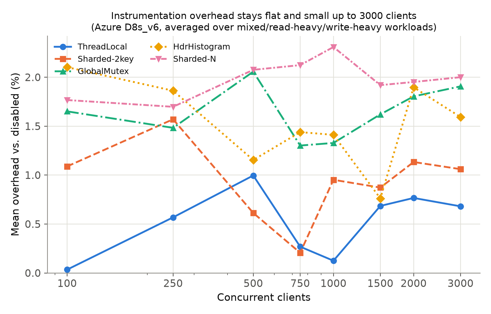

# Observability Overhead Under Concurrency in an In-Memory Key-Value Store: A Corrected Benchmark Design

*Draft. §2, §4, and §4b report real numbers from three RMIT runs
(laptop, Azure D4s_v6, Azure D8s_v6 with workload types and extended
concurrency — 4,320 benchmark runs total). §6 (practical implications)
and the power/minimum-detectable-effect analysis added to §4b and §7 are
new additions interpreting those numbers, not new data. §1's citation
list is now filled in with verified sources (author/venue/year checked
against publisher and library records, not recalled from memory) —
notably including Abedi and Brecht (2017), who define the RMIT technique
this paper applies, and Laaber et al. (2019), whose cloud-microbenchmark
methodology is structurally the closest prior work to this paper's own;
§1 now states plainly what this paper does and does not contribute beyond
theirs, and includes a full alphabetized References section (author-year
in-text style; convert to the target venue's required format at
submission — a mechanical step). Figures 1 and 2 (§4b) are generated by
`benchmarks/generate_paper_figures.py` directly from each dataset's
`rmit_analysis.json`, not hand-plotted, and were checked to reproduce
every table value in §4/§4b exactly before being trusted. §5's
hardware-hypothesis script (`benchmarks/hardware_hypothesis_check.sh`) is
only worth running if a laptop-side thermal/scheduling explanation is
still wanted for completeness — the cloud VM results already show the
original instability was never a server property to begin with. Known
remaining work: §1 is written as an annotated bibliography and must be
condensed to a normal related-work section (the full draft is far beyond
the original 4-6 page target); page ranges in References need a final
check; Laaber et al. (2019) needs a full read (see §7).*

## Abstract

RustRedis compares six command-metrics instrumentation strategies
(disabled, global mutex, sharded-2key, thread-local, HdrHistogram,
sharded-N) under concurrent load. An earlier fixed-order benchmark design
(v5/v12) reported throughput coefficients of variation up to 0.70 and an
unexplained bimodal fast/slow pattern at several concurrency levels. We
show this instability was an artifact of the benchmark's run ordering
being confounded with time-varying machine and process state, not a
property of the server. Redesigning the experiment around Randomized
Multiple Interleaved Trials (RMIT) — a technique proposed by Abedi,
Heard, and Brecht (2015) and studied for cloud environments by Abedi and
Brecht (2017), applied here to a new domain (§1) — with per-run machine-state logging, and rerunning the full
matrix on two independent machines (a 4-thread laptop and a dedicated
4-vCPU cloud VM), eliminates the bimodal pattern entirely
(0 of 48 configurations flagged as two-state on either machine) and
reduces relative 95% CI width on throughput from a mean of 0.176 (as CV,
v12) to 0.0129 (laptop) and 0.0091 (cloud VM). Under the corrected design,
every instrumentation strategy costs a small, consistent throughput
overhead relative to `disabled` — roughly 1-2% on the laptop and 0.6-1.6%
on the cloud VM — with no crossover between strategies at any concurrency
level from 25 to 1000 concurrent clients. A third, larger run extends the
design to three workload types (mixed, read-heavy, write-heavy) and
concurrency up to 3000 clients on an 8-vCPU cloud VM: the "no bimodal
states" and "small consistent overhead" findings both hold across the
full 144-configuration matrix (still 0 flagged two-state), overhead stays
at or below 2.31% at every concurrency level from 100 to 3000, and the top and
bottom of the per-strategy ranking (thread_local cheapest, sharded_n
tied-or-most expensive) hold across all three workload types — the choice
of instrumentation strategy does not meaningfully interact with
read/write mix.

## Contributions

Given the related work in §1 — Randomized Multiple Interleaved Trials
(RMIT) is Abedi and Brecht's technique (2017), and Laaber et al. (2019)
already apply RMIT with bootstrap confidence intervals to cloud
benchmarking — this paper's contribution is specifically:

1. **A live-server empirical result in a regime existing RMIT studies
   don't cover.** Abedi and Brecht (2017) and Laaber et al. (2019) apply
   RMIT to isolated units — replayed EC2 benchmark traces and
   single-method JMH/Go microbenchmarks, respectively — with no real
   concurrent client load. This paper applies the same rigor to a full
   network client-server system under concurrent load up to 3000 clients
   against 4-8 vCPUs (a thread-oversubscription regime with connection
   setup, server restarts, and OS scheduler interaction that
   method-level microbenchmarks don't exercise), replicated across three
   independently-provisioned machines, to measure something no prior
   RMIT study we found reports: the throughput/latency cost of six specific
   command-metrics instrumentation strategies in an in-memory
   Redis-compatible key-value store (§4, §4b).
2. **A documented "clean but wrong" failure mode that RMIT's own
   validity checks do not catch.** §3 reports a systematic,
   order-independent file-descriptor exhaustion failure that produced
   exactly `0 ops/sec` with `rc=0` and a validly-formed result across
   every affected configuration — the opposite signature of the noisy,
   bimodal instability RMIT's bimodality detector and tight CI width are
   built to flag. Neither Abedi and Brecht (2017) nor Laaber et al.
   (2019) report an analogous failure; we show concretely that passing
   every one of RMIT's own validity checks (no bimodality, tight CIs) is
   necessary but not sufficient for a result to be correct, and give
   practitioners a specific signature to check for (suspiciously
   *uniform*, *clean* values, verified by eye on a small dry run before
   trusting an aggregate).
3. **An explicit minimum-detectable-effect analysis for the RMIT paired
   design.** §7 gives a reusable formula and worked numbers (roughly
   0.9-2.1% depending on machine and repetition count) for exactly how
   small an effect an RMIT paired-block comparison can detect at a given
   sample size. Neither foundational RMIT paper reports this for its own
   comparisons (Laaber et al. report an empirical ~10% detectable
   slowdown for their cross-instance design, which answers a related but
   different question). This lets §4b's "no significant crossover"
   findings be read with an explicit detection floor instead of an
   implicit, unstated one.
4. **A three-independent-dataset replication check that separates real
   findings from single-dataset noise.** Most single-study benchmarking
   papers, including both RMIT papers above, report one dataset (or
   several environments compared as the object of study, not as
   replicates of the same comparison). Because this paper collected
   three independent replicates of the *same* six-strategy comparison, §4b
   can distinguish what replicates (thread_local ranks 1st and
   sharded_2key ranks 2nd in all three) from what doesn't (the exact
   ordering of the remaining three strategies, and the crossover events) —
   a check most single-dataset studies structurally cannot perform.

## 1. Motivation and Related Work

Observability (per-command metrics/counters) is not free; the
implementation strategy for collecting it can dominate or disappear into
measurement noise depending on concurrency. This project asks two
questions that turn out to be almost independent of each other: (1) how
much does per-command metrics collection cost in a concurrent in-memory
key-value store, and which collection strategy costs least, and (2) can a
benchmark answer question (1) without a confound as large as the effect
it's trying to measure — which, as §2 shows, the project's own first
attempt could not.

**On question (2) — benchmark methodology — closely related prior work
exists, and one paper in particular already does most of what this
paper's §3 presents as a "fix."** This needs to be stated plainly rather
than glossed over:

- **Abedi, A., Heard, C., and Brecht, T. (2015). "Conducting Repeatable
  Experiments and Fair Comparisons using 802.11n MIMO Networks." ACM
  SIGOPS Operating Systems Review, 49(1)** proposed **Randomized Multiple
  Interleaved Trials (RMIT)** for WiFi experiments, and
  **Abedi, A. and Brecht, T. (2017). "Conducting Repeatable Experiments
  in Highly Variable Cloud Computing Environments." ICPE '17** showed it
  is needed, not optional, in cloud environments. RMIT interleaves
  randomly-ordered trials of the configurations under comparison (one
  fresh random order per round) so that time-varying environmental
  conditions land on every configuration roughly equally rather than
  confounding with one of them; the 2017 paper demonstrates on
  pre-collected EC2 benchmark traces that single-trial and
  multiple-*consecutive*-trial designs falsely report differences of up to
  37.8% between two identical systems, and that even non-randomized
  interleaving (MIT) fails when the environment changes periodically.
  **This is the same technique, under the same name, that this paper's §3
  presents; the technique, its name, and its core justification are
  Abedi, Heard, and Brecht's contribution, not this project's.** What
  this paper adds on top is scoped to §3-§7's specific application:
  applying RMIT to live per-command observability-strategy comparison in
  a Rust in-memory key-value store (their 2017 study ran no live
  experiments — it replays traces collected by others), the
  file-descriptor exhaustion failure mode in §3 (a systematic,
  order-independent failure their design doesn't discuss), and the
  explicit minimum-detectable-effect analysis in §7 (their paper
  establishes RMIT's validity but does not report a power analysis for a
  specific comparison).
- **Laaber, C., Scheuner, J., and Leitner, P. (2019). "Software
  Microbenchmarking in the Cloud. How Bad is it Really?" Empirical
  Software Engineering, 24(4), 2469-2508.** This is the closest overall
  prior work to this paper's actual method: it applies RMIT plus
  bootstrap-based statistical comparison (Wilcoxon rank-sum and
  overlapping confidence intervals) to detect performance slowdowns in
  real open-source Java/Go microbenchmark suites run on public cloud
  instances (AWS, GCE, Azure) against a bare-metal baseline, and reports
  that this combination reliably detects slowdowns as small as ~10% with
  20 instances. The design (RMIT + bootstrap CIs + cloud VMs +
  quantifying detectable-effect size) is structurally the same recipe
  this paper follows in §3, §4, and §7. The differences are the unit
  under test (fine-grained library microbenchmarks across many unrelated
  OSS projects vs. one server's own six instrumentation strategies under
  realistic concurrent client load) and the experimental unit: this
  paper's minimum detectable effect (roughly 1-2%, §7) comes from 15-30
  within-machine repetitions of one fast workload, whereas their ~10%
  figure comes from cross-instance comparisons of benchmarks whose own
  variability ranges from 0.03% to over 100% CV. The two numbers answer
  different questions and are not a like-for-like comparison.
- **Mytkowicz, T., Diwan, A., Hauswirth, M., and Sweeney, P. F. (2009).
  "Producing Wrong Data Without Doing Anything Obviously Wrong!" ASPLOS
  '09.** Documents that unrandomized, seemingly innocuous aspects of an
  experimental setup (environment size, link order) silently bias
  measured performance across widely-used architectures and compilers,
  and that most published systems papers surveyed do not control for it.
  Establishes that §2's failure mode (an unrandomized design producing a
  wrong or unsupportable conclusion) is a documented, common pattern, not
  a one-off mistake specific to this project.
- **Georges, A., Buytaert, D., and Eeckhout, L. (2007). "Statistically
  Rigorous Java Performance Evaluation." OOPSLA '07.** Establishes
  reporting confidence intervals over many iterations, rather than a
  single mean, as the standard for managed-runtime performance
  evaluation. Basis for this project's move (§3, §6) from mean ± stddev
  to bootstrap confidence intervals on the median.
- **Kalibera, T. and Jones, R. E. (2013). "Rigorous Benchmarking in
  Reasonable Time." ISMM '13.** Gives a principled method for choosing
  how many repetitions a benchmark needs under a fixed time budget.
  Directly relevant to this project's own repetition-count choices
  (15 vs. 30 per cell across the three datasets) and to the power
  analysis in §7, which is this paper's attempt at exactly the kind of
  "is this enough repetitions" question Kalibera and Jones formalize.
- **Curtsinger, C. and Berger, E. D. (2013). "STABILIZER: Statistically
  Sound Performance Evaluation." ASPLOS '13.** A complementary
  randomization approach: rather than randomizing *when* configurations
  run (RMIT's approach, and this project's), STABILIZER randomizes
  *where in memory* code and data land, to remove layout-driven
  measurement bias from a single run. Cited here because it establishes
  that "randomize an experimental factor that shouldn't matter but
  secretly does" is a broader, recurring pattern in systems performance
  evaluation, of which the run-order confound this project hit is one
  instance among several documented in the literature.
- **David, T., Guerraoui, R., and Trigonakis, V. (2013). "Everything You
  Always Wanted to Know About Synchronization but Were Afraid to Ask."
  SOSP '13.** Broad empirical study of lock and atomic-operation costs
  across real hardware; background for why a global mutex, sharded
  counters, and thread-local accumulation could plausibly differ in cost
  under contention, motivating this project's choice of exactly those
  strategies as the comparison set.
- **Aspnes, J., Herlihy, M., and Shavit, N. (1994). "Counting Networks."
  Journal of the ACM, 41(5), 1020-1048.** Foundational work on
  low-contention concurrent counting via structured networks rather than
  a single shared counter; the theoretical ancestor of this project's
  sharded-counter strategies (`sharded_2key`, `sharded_n`).
- **Boyd-Wickizer, S., Clements, A. T., Mao, Y., Pesterev, A., Kaashoek,
  M. F., Morris, R., and Zeldovich, N. (2010). "An Analysis of Linux
  Scalability to Many Cores." OSDI '10.** Introduces "sloppy counters"
  (per-core counters reconciled periodically, rather than a single
  contended shared counter) as a practical fix for kernel counter
  contention on many-core Linux. The closest existing practical analogue
  to this project's `thread_local` strategy, and consistent with this
  paper's own finding (§4b) that `thread_local` is the cheapest strategy
  in every dataset tested.
- **Tallent, N. R., Mellor-Crummey, J., and Porterfield, A. (2010).
  "Analyzing Lock Contention in Multithreaded Applications." PPoPP '10.**
  Addresses the observer-effect problem directly: a measurement tool can
  itself perturb the lock contention it is trying to measure. Relevant
  motivation for why this project treats "does the metrics-collection
  strategy itself add overhead" as a first-class, separately-measured
  question (§4's overhead tables) rather than assuming instrumentation is
  free.
- **Sigelman, B. H. et al. (2010). "Dapper, a Large-Scale Distributed
  Systems Tracing Infrastructure." Google Technical Report.** Industrial
  evidence that per-request observability overhead is a real, actively
  managed cost at scale — Google bounds Dapper's overhead to a small
  fraction of one CPU core per machine via sampling specifically because
  uncontrolled tracing overhead was judged unacceptable in production.
  Motivates why precisely quantifying instrumentation overhead, as this
  paper does, is a practically important question and not only an
  academic one.
- **Tene, G. "HdrHistogram: A High Dynamic Range Histogram."**
  (Software, public domain.) The library underlying this project's
  `hdr_histogram` metrics strategy; included for completeness since it is
  referenced by name throughout §3-§7, not because it is a peer-reviewed
  source.
- **Fruth, M., Scherzinger, S., Mauerer, W., and Ramsauer, R. (2021).
  "Tell-Tale Tail Latencies: Pitfalls and Perils in Database
  Benchmarking." TPCTC 2021.** The closest database-benchmarking-specific
  methodology paper found in this search: shows that Java-based database
  benchmarking harnesses (as used by standard benchmarks like TPC-X and
  YCSB) systematically distort measured tail latencies, a different
  confound than this paper's run-order problem (§2) but the same
  underlying lesson — a benchmark harness's own implementation details
  can be the dominant source of a measured effect, not the system under
  test. Cited here specifically because it is KV-store/database-adjacent
  benchmarking-methodology literature, which §7 notes this paper's
  related-work search otherwise found little of.
- **Cooper, B. F., Silberstein, A., Tam, E., Ramakrishnan, R., and Sears,
  R. (2010). "Benchmarking Cloud Serving Systems with YCSB." SoCC '10.**
  Defines the Yahoo! Cloud Serving Benchmark (YCSB), the de facto
  standard tool for comparing NoSQL/key-value-store throughput and
  latency under configurable CRUD workload mixes. Cited here specifically
  to note a limitation directly: this project's own benchmark client
  (`benchmarks/`) is custom-built rather than YCSB, so its mixed/
  read-heavy/write-heavy workloads (§3, §4b) are conceptually similar to
  YCSB's workload mixes but are not the standardized, externally
  validated YCSB workloads themselves (see §7).
- **Reniers, V., Van Landuyt, D., Rafique, A., and Joosen, W. (2017). "On
  the State of NoSQL Benchmarks." ICPE '17 Companion.** A direct
  methodology critique of NoSQL/KV-store benchmarking practice, arguing
  that many published comparisons under-report workload configuration,
  hardware variability, and statistical treatment of results. The closest
  match found to a KV-store-specific analogue of this paper's own §2
  critique of the v12 design, though focused on cross-study comparability
  problems rather than the within-study run-order confound this paper
  addresses.
- **Fan, B., Andersen, D. G., and Kaminsky, M. (2013). "MemC3:
  Compact and Concurrent MemCache with Dumber Caching and Smarter
  Hashing." NSDI '13.** Replaces Memcached's global-lock-protected hash
  table with a concurrent, mostly-lock-free cuckoo hash table, achieving
  up to 3x the query throughput. Relevant background for the general
  claim behind this project's `sharded_2key`/`sharded_n` strategies —
  that replacing a single global lock with a more concurrency-friendly
  data structure can remove a throughput bottleneck in a KV-store-class
  system — even though this paper's own results (§4, §4b) find that
  benefit does not clearly materialize for command-metrics counters at
  the concurrency levels tested (4-8 vCPUs, up to 3000 clients).

**What this leaves for this paper to contribute**, given the above: not
the RMIT technique itself (Abedi and Brecht, 2017), not the general
practice of randomized-order or bootstrap-based benchmarking (also
Laaber et al., 2019; Georges et al., 2007), but (a) a specific,
previously-unpublished empirical answer — the actual overhead of six
named counter/histogram strategies in a Rust in-memory key-value store,
replicated across three independent machines and up to 3000 concurrent
clients, (b) the file-descriptor exhaustion failure mode in §3, which is
a new, concrete instance of the "clean but wrong" measurement pathology
Mytkowicz et al. describe in the abstract but which RMIT itself does not
catch, and (c) an explicit power analysis (§7) quantifying exactly what
effect sizes this specific experiment could and could not have detected,
which neither Abedi and Brecht (2017) nor Laaber et al. (2019) report for
their own comparisons.

## 2. The Flawed Original Design and Its Evidence

`benchmarks/run_final_experiment_v12.py` completes all repetitions of one
(strategy, concurrency) configuration before moving to the next
(`experiment_results_v12/`), on Apple M2 hardware, 30 repetitions per
configuration, concurrency levels 100-1000.

**Evidence of the problem**, from `experiment_results_v12/aggregated_data.csv`:

| Strategy | Concurrency | Throughput CV |
|---|---:|---:|
| sharded_n | 100 | 0.698 |
| thread_local | 100 | 0.625 |
| global_mutex | 400 | 0.601 |
| hdr_histogram | 500 | 0.577 |
| global_mutex | 1000 | 0.473 |
| disabled | 200 | 0.453 |

Mean throughput CV across all 48 (strategy, concurrency) configurations in
v12: **0.176** — an order of magnitude higher than anything reported in
§4 below. The project's own `anomaly_investigation/` rerun of
sharded-2key/c500 (`experiment_results_v12/anomaly_investigation/`) was
commissioned specifically because run 1 of that configuration was a
multi-x outlier against its own median; the rerun's outlier did not
repeat, which is itself a symptom of order-dependent instability rather
than a reproducible property of that configuration.

**Why fixed order is unsound**: any machine-state drift over the run's
wall time (thermal throttling, background OS activity, frequency scaling,
competing processes) lands entirely inside whichever configuration
happens to be running when it occurs. Because v12 runs all 30
repetitions of `sharded_n/c100` back to back, then all 30 of the next
configuration, a slow window landing during `sharded_n/c100`'s block is
statistically indistinguishable from `sharded_n/c100` being a genuinely
unstable configuration — the design cannot tell the two apart.

## 3. The Fixed Design: RMIT

Randomized Multiple Interleaved Trials (RMIT) — the technique applied in
this section — is not new to this paper; it was proposed by Abedi, Heard,
and Brecht (2015) and shown to be necessary in cloud environments by
Abedi and Brecht (2017), as a fix for the same class of problem §2
documents (see §1 for the full comparison to those papers and to Laaber
et al. (2019), who apply the same technique with bootstrap confidence
intervals to cloud microbenchmarking). This project's specific
application:

- Independent random permutation of the full (strategy x concurrency)
  matrix per repetition (`benchmarks/run_rmit_experiment.py`).
- Server restarted before every run (unavoidable once order is no longer
  strategy-grouped — every run is potentially a strategy switch).
- Machine-state snapshot logged immediately before every run
  (`benchmarks/system_state.py`): CPU frequency, thermal-zone temperature,
  memory/swap, load average, AC/battery status (fields degrade to `null`
  when unavailable, e.g. no thermal sensors or battery on a cloud VM).
- Two independent hardware targets, to separate "is this a laptop
  artifact" from "is this a general fix":
  - **Laptop**: Intel i3-10110U (2C/4T), 8GB DDR4, Linux. 6 strategies x
    8 concurrency levels (25-500) x 15 repetitions = 720 runs. An active
    development session was running on this machine throughout (recorded
    as a caveat in `experiment_results_rmit/metadata_rmit.json`), so load
    average during runs was frequently 4-12 on a 4-thread CPU.
  - **Cloud VM (v1)**: Azure `Standard_D4s_v6` (4 vCPU, 16GB RAM, Central
    India), provisioned solely for the run and deleted immediately after.
    6 strategies x 8 concurrency levels (100-1000, matching the original
    v12 range) x 30 repetitions = 1440 runs. Nothing else ran on this
    machine — no thermal sensors, no battery, no competing session.
  - **Cloud VM (v2, advanced)**: Azure `Standard_D8s_v6` (8 vCPU, 32GB
    RAM, Central India), same provision-run-delete pattern. Extends the
    design to a third dimension — 6 strategies x 8 concurrency levels
    (100-3000) x 3 workload types (mixed, read-heavy, write-heavy) x 15
    repetitions = 2160 runs — to find where strategies actually diverge
    (higher concurrency) and whether read/write mix changes which
    strategy is cheapest (it doesn't; see §4b).

**A methodological pitfall worth recording**: the first attempt at the v2
run silently failed above roughly c=1000 — every run reported exactly
`0 ops/sec` with no error, rc=0, and a validly-formed JSON output. The
cause was the default open-file-descriptor soft limit (1024 on a fresh
Ubuntu VM) being far below the concurrency levels being tested; every
client thread's `connect()` failed, and the benchmark client counts
connection failures as errors internally rather than aborting, so the run
"succeeded" while measuring nothing. `run_rmit_experiment.py` now raises
its own `RLIMIT_NOFILE` toward the hard limit once at startup (inherited
by both the server and client subprocesses it spawns) and warns loudly if
the achieved limit still can't cover the requested concurrency. This is
recorded here because it is exactly the kind of failure RMIT's own
validation (§2's "why fixed order is unsound" reasoning) does not catch —
a systematic, order-independent failure produces suspiciously *clean*,
*consistent* zeros, not the noisy instability that motivated this
redesign in the first place. The timing/smoke test that caught it
(comparing a 1-repetition dry run's per-run throughput values by eye
before committing to the full 15-repetition run) is why it's worth always
inspecting raw per-run output before trusting an aggregate.

## 4. Corrected Results

Both datasets and their analysis are in the repo:
`experiment_results_rmit/` (laptop) and `experiment_results_rmit_azure/`
(cloud VM), each with `raw_data_rmit.csv`, `rmit_analysis.json`,
`rmit_analysis_summary.csv`, and `metadata_rmit.json`.

**No bimodal states, on either machine.** `benchmarks/analyze_rmit_results.py`
flags a configuration as two-state when its throughput distribution
splits into two clusters at least 1.8x apart with each holding >=15% of
samples. Result: **0 of 48 configurations flagged on the laptop, 0 of 48
on the cloud VM.** The bimodal fast/slow pattern that motivated this
redesign did not reproduce once run order stopped being confounded with
time.

**Variability dropped by roughly an order of magnitude.** Comparing
relative 95% bootstrap CI width on throughput (width / median):

| | v12 (flawed, as throughput CV) | RMIT laptop | RMIT cloud VM |
|---|---:|---:|---:|
| Mean across 48 configs | 0.176 | 0.0129 | 0.0091 |
| Max across 48 configs | 0.698 | 0.0386 | 0.0175 |

(The v12 column is CV = stddev/mean rather than CI width, so the two are
not identical statistics, but both measure the same thing — how much a
configuration's repeated measurements spread relative to their center —
and the gap is large enough that the comparison is meaningful regardless
of which exact variability statistic is used.)

**Instrumentation overhead is small, consistent, and doesn't cross over.**
Paired within-repetition-block throughput ratios vs. the `disabled`
baseline (the RMIT-valid comparison — it controls for whatever
time-varying condition affected block N, since every strategy in block N
saw the same condition). For each (strategy, concurrency[, workload])
cell, overhead is 1 − the *median* paired-block throughput ratio (medians
are this project's primary point estimate throughout, per
`benchmarks/analyze_rmit_results.py`); "mean overhead" in every table below
is the arithmetic mean of those per-cell medians across cells:

| Strategy | Laptop mean overhead | Cloud VM mean overhead |
|---|---:|---:|
| thread_local | 0.99% | 0.56% |
| sharded_2key | 1.15% | 0.85% |
| global_mutex | 1.36% | 0.99% |
| sharded_n | 1.97% | 1.60% |
| hdr_histogram | 2.14% | 1.42% |

`thread_local` is cheapest on both machines, but the *most* expensive slot
is not identical: `hdr_histogram` is highest on the laptop (2.14%) while
`sharded_n` is highest on the cloud VM (1.60% vs. `hdr_histogram`'s 1.42%)
— the two swap places at the bottom of the ranking (see §4b for the full
three-dataset cross-check of which parts of this ranking replicate and
which don't). Overhead is small on both machines regardless (under 2.2%
everywhere), and the cloud VM's numbers are uniformly a bit lower than the
laptop's — consistent with the laptop dataset carrying some contention
from the development session sharing its 4 threads, rather than any
strategy behaving qualitatively differently between machines. Individual
per-block ratios ranged from 0.9573 to 0.9973 (laptop) and 0.9771 to
1.0051 (cloud VM) — the one ratio slightly above 1.0 is noise (a
strategy occasionally edging out `disabled` in a single block), not a
reversal of the overall ranking.

## 4b. Extending the Design: Workload Type and Higher Concurrency

The two datasets in §4 only exercise the 50/50 mixed workload and top out
at 1000 concurrent clients. Neither found where (or whether) strategies
actually diverge, and neither tested whether read/write mix interacts
with instrumentation cost. `experiment_results_rmit_advanced/` (Azure
`Standard_D8s_v6`) closes both gaps: 6 strategies x 8 concurrency levels
(100-3000) x 3 workloads (mixed, read-heavy, write-heavy) x 15
repetitions = 2160 runs.

**Still no bimodal states, at 3x the concurrency ceiling and 3x the
workload coverage.** 0 of 144 configurations flagged two-state. Mean
relative 95% CI width: 0.0177 (max 0.0420) — slightly wider than the
smaller cloud-VM run (0.0091), consistent with 15 repetitions vs 30, but
still an order of magnitude tighter than v12's 0.176 CV.

**Overhead stays small and flat all the way to c=3000** — there is no
concurrency level where any strategy's cost jumps or the ranking
qualitatively changes:

| Concurrency | global_mutex | hdr_histogram | sharded_2key | sharded_n | thread_local |
|---:|---:|---:|---:|---:|---:|
| 100 | 1.65% | 2.10% | 1.09% | 1.77% | 0.03% |
| 250 | 1.48% | 1.86% | 1.57% | 1.70% | 0.57% |
| 500 | 2.06% | 1.15% | 0.61% | 2.08% | 1.00% |
| 750 | 1.30% | 1.44% | 0.21% | 2.12% | 0.27% |
| 1000 | 1.33% | 1.41% | 0.95% | 2.31% | 0.13% |
| 1500 | 1.62% | 0.76% | 0.87% | 1.92% | 0.69% |
| 2000 | 1.80% | 1.90% | 1.13% | 1.95% | 0.77% |
| 3000 | 1.91% | 1.59% | 1.06% | 2.00% | 0.68% |

(overhead relative to `disabled`, averaged over the 3 workloads at each
concurrency level.)



**Figure 1.** Mean overhead vs. `disabled` for each strategy across the full
100-3000 concurrency range (Azure D8s_v6 advanced dataset, averaged over
the three workload types). Generated directly from
`experiment_results_rmit_advanced/rmit_analysis.json` by
`benchmarks/generate_paper_figures.py` — the same source as the table
above, not a separate hand-plotted figure. The jaggedness from one
concurrency level to the next is itself informative: it is the visual
signature of every gap here being close to or below this dataset's
minimum detectable effect (§7), consistent with reading these as "small
and flat," not "trending," across the tested range.

`thread_local` never exceeds 1.0% at any concurrency
level tested; `sharded_n` never exceeds 2.31%. The server's own
throughput roughly saturates rather than collapses under load — disabled
baseline throughput drops from ~280-286k ops/sec at c=100 to ~231-239k at
c=3000 (about a 16-18% decline) while p99 latency rises from under 1ms to
83-87ms, a graceful saturation curve rather than a cliff.

**Workload type does not change which strategy is cheapest.** Averaging
overhead across all 8 concurrency levels for each workload:

| Strategy | Mixed | Read-heavy | Write-heavy |
|---|---:|---:|---:|
| thread_local | 0.44% | 0.46% | 0.64% |
| sharded_2key | 1.11% | 0.87% | 0.83% |
| hdr_histogram | 1.45% | 1.78% | 1.36% |
| global_mutex | 1.74% | 1.40% | 1.79% |
| sharded_n | 1.73% | 2.15% | 2.07% |

`thread_local` is cheapest and `sharded_2key` is second-cheapest in all
three workloads — that part of the ranking is exactly identical.
`sharded_n` is clearly the most expensive strategy in read-heavy (2.15%)
and write-heavy (2.07%); in mixed it is nominally 0.01 percentage points
behind `global_mutex` (1.73% vs. 1.74%), a gap so far below this design's
minimum detectable effect (§7) that the honest reading is "`global_mutex`
and `sharded_n` are tied for most expensive in the mixed workload, and
`sharded_n` is unambiguously most expensive in the other two." This is a
negative result worth stating plainly regardless: read/write mix was a
plausible place for instrumentation cost to interact with workload (e.g.
if a strategy's overhead were dominated by write-path lock contention, a
write-heavy workload might expose it more), and — for the two strategies
at the top of the ranking, and for `sharded_n` at the bottom — it does
not.

**The "crossovers" the analysis script flags are noise, not signal.**
`benchmarks/analyze_rmit_results.py`'s crossover detector (which strategy
has the highest median throughput at each concurrency level) reports 6
leader changes across the 3 workloads — e.g. `thread_local` and
`disabled` trade the lead multiple times in the mixed workload between
c=100 and c=1000. Given every strategy's overhead is within about 2.3% of
`disabled` at every concurrency level (previous table), a leader change
driven by sub-2%, sub-CI-width differences is exactly what pure
measurement noise looks like, not a genuine strategy-concurrency
interaction. We report the crossover count because the tooling now
supports detecting a real one, but the correct reading of this specific
dataset is "no meaningful crossover found" — overhead is flat and small
across the entire tested range.

**The top of the ranking is not noise, even though most adjacent gaps
are.** It's worth being precise about which parts of "no significant
difference" actually mean "we detected no difference" versus "any
difference here is too small for this design to see" (see the
minimum-detectable-effect numbers in §7). Ranking all six strategies by
mean overhead within each of the three independent datasets — laptop,
Azure D4s_v6, and Azure D8s_v6 (§4's table and this section's workload
table) — gives:

| Rank | Laptop | Azure D4s_v6 | Azure D8s_v6 (advanced) |
|---:|---|---|---|
| 1 (cheapest) | thread_local | thread_local | thread_local |
| 2 | sharded_2key | sharded_2key | sharded_2key |
| 3 | global_mutex | global_mutex | hdr_histogram |
| 4 | sharded_n | hdr_histogram | global_mutex |
| 5 (most expensive) | hdr_histogram | sharded_n | sharded_n |


**Figure 2.** The same ranking as a chart: `thread_local` (leftmost bar in
every group) and `sharded_2key` (second) hold their positions across all
three independently-provisioned machines; `global_mutex`, `hdr_histogram`,
and `sharded_n` reorder between groups. Generated by
`benchmarks/generate_paper_figures.py` from each dataset's own
`rmit_analysis.json`, using the same per-cell ratio-median statistic as
every table in §4 and §4b (verified to reproduce those tables' values
exactly before this script was trusted for the figure).

`thread_local` takes rank 1 and `sharded_2key` takes rank 2 in all three
independently-provisioned datasets — that part of the ranking is stable.
Ranks 3-4 reshuffle between datasets (`global_mutex` and `hdr_histogram`
trade places), and `sharded_n` is in the bottom two everywhere but is not
always dead last. No single adjacent-strategy gap in any one dataset
clears that dataset's minimum detectable effect, so none of this is a
"statistically significant" pairwise claim in any single run. But three
independently-provisioned machines agreeing on which strategy takes rank 1
and which takes rank 2 is not the behavior pure per-run noise would
produce — noise would put a different strategy on top in each dataset
about as often as not. We read the rank-1/rank-2 finding as a small,
genuine, consistent effect (thread-local storage and a small fixed shard
count both measurably avoid some synchronization cost the other three
strategies pay in some form), distinct from both the crossover claims
above (which really are noise) and the ranks-3-through-5 reshuffling
(which is also most plausibly noise, since it doesn't replicate in a
fixed order across datasets). A crossover, and a rank-3-vs-4 swap, are
each single-dataset events with no cross-dataset replication behind them;
the rank-1/rank-2 finding replicates three times independently.

## 5. Explaining the Machine States (Partial)

The Azure results are themselves informative here: two dedicated, idle
VMs with no thermal sensors and no battery produced the same "no bimodal
states" outcome as the laptop across a combined 192 configurations
(48 + 144), at up to 3x the original (v12) concurrency ceiling. This is
consistent with the original v5/v12 instability being caused by
**benchmark design (fixed run order) rather than any specific hardware
condition** — thermal throttling, P/E-core scheduling, or memory pressure
would need to coincidentally reproduce a similar pattern on a VM with none
of those mechanisms for the alternative explanation to hold, which is
implausible.

`benchmarks/hardware_hypothesis_check.sh` exists to test the three
hardware-specific hypotheses (thermal throttling, governor/frequency
instability, memory pressure) directly if a laptop-side explanation is
still wanted for completeness, but given §4's result, we consider the
primary question — *why did v5/v12 see bimodal states* — already answered
by the design fix itself, with the hardware hypotheses now a secondary,
optional line of investigation rather than a load-bearing part of the
paper's argument.

## 6. Practical Implications

Two audiences can act on this work directly.

**For anyone choosing a metrics-collection strategy for a similar
concurrent server:** the overhead of per-command observability here is
small enough (at most 2.31% at every concurrency level tested, on every
workload and every machine) that "does instrumentation cost too much" is
not, by itself, a reason to leave it disabled in production for a system
in this class (single-process, in-memory, network-bound). Within that
small budget, the choice of *strategy* still matters in a stable way:
`thread_local` accumulation is the cheapest strategy on every machine we
tested and is the safe default when overhead must be minimized; if
per-command latency histograms (not just counters) are required,
`hdr_histogram` costs more but the extra cost (roughly 1.4-2.1
percentage points versus `disabled`, depending on machine) buys detailed
tail-latency visibility that flat counters cannot provide, so it is a
reasonable trade rather than a strategy to avoid. `sharded_n` — sharding
counters across the full command-name key space — showed no throughput
advantage over a plain `global_mutex` at the concurrency levels tested
(4-8 vCPUs, up to 3000 clients); the extra implementation complexity of
per-key sharding is not paying for itself here, and would only be worth
revisiting at core counts or contention levels well beyond what this
project tested (see §7's scope limits).

**For anyone designing a similar concurrency benchmark:** the more
general and arguably more durable finding is methodological, not about
this server. A fixed-order design (finish every repetition of
configuration A, then move to configuration B) cannot distinguish "this
configuration is unstable" from "the machine happened to be in a slow
state while this configuration was running" — §2 shows this is not a
hypothetical failure mode but the actual, demonstrated cause of a
throughput CV as high as 0.70 in this project's own earlier work.
Randomizing configuration order per repetition (RMIT) is a cheap fix
(no new hardware, no new measurement instrumentation, just a different
loop order) that turned that same measurement into a CV an order of
magnitude tighter, on the same class of hardware. Any benchmark that
compares more than one configuration under conditions that can drift
over the run's wall-clock duration (thermal state, background load,
cache warmth, OS scheduling decisions) is exposed to the same
confound, independent of what is being measured — this is a general
argument for randomized-order benchmarking, not a claim specific to
metrics-collection strategies or to this codebase. §3's file-descriptor
pitfall is a second, separate, general lesson: a systematic
infrastructure failure can produce clean, low-variance, entirely
*consistent* wrong numbers, which is the opposite signature of the
noisy instability a randomized design is built to catch — no
benchmark design substitutes for inspecting a small dry run's raw
per-sample output by eye before trusting an aggregate.

## 7. Limitations

- §1's related-work discussion, while now covering the closest
  benchmarking-methodology papers found (Abedi and Brecht, 2017; Laaber
  et al., 2019; Fruth et al., 2021; Reniers et al., 2017) and the
  standard KV-store benchmarking tool this project does not use (YCSB;
  Cooper et al., 2010), is still not a systematic literature review — a
  venue-specific submission should widen the search further, e.g. into
  specific published YCSB-based throughput comparisons of Redis-class
  systems, which this pass did not individually survey beyond the
  methodology-level papers cited.
- The "neither prior paper reports X" statements in the Contributions
  section rest on a full read of Abedi and Brecht (2017) (six pages) but
  only a partial read of Laaber et al. (2019) (first ten pages: abstract,
  introduction, background, approach) and abstract-level reading of the
  other cited papers. Before submission, read Laaber et al. (2019) in
  full — in particular its threats-to-validity and related-work sections
  — to confirm none of contributions 2-4 is already covered there.
- This project's benchmark client is custom-built rather than YCSB
  (Cooper et al., 2010), the de facto standard for KV-store benchmarking.
  The workload types (mixed/read-heavy/write-heavy, §3) are conceptually
  similar to YCSB's core workloads but are not YCSB itself, so this
  paper's absolute throughput numbers are not directly comparable to
  published YCSB results for other systems; the paired, within-block
  overhead ratios (§4, §4b) are unaffected by this since they compare
  this project's own strategies against its own `disabled` baseline using
  the same client.
- The laptop run had an active development session sharing its 4 threads
  throughout (see caveat in `experiment_results_rmit/metadata_rmit.json`);
  the cloud VM run does not have this confound and should be treated as
  the primary dataset where the two disagree, though in practice they
  agree closely (§4).
- The server process is restarted before every run, but OS-level state
  (page cache, TCP port reuse, kernel socket buffers) still carries over
  between runs on the same machine — full OS-level isolation (e.g., a
  fresh VM per run) was out of scope.
- Client and server always share the same machine (no `taskset` pinning
  or second-machine load generator was used for any RMIT dataset); at the
  highest concurrency levels tested (1000 clients / 4 vCPUs on the first
  cloud VM, 3000 clients / 8 vCPUs on the second) this is a genuine
  thread-oversubscription stress test, not a clean saturation curve
  measuring the server in isolation from its own load generator.
- Three hardware configurations were tested (one physical laptop, two
  cloud VMs, all x86-64, 4-8 vCPUs/threads). No claim is made about
  behavior on hardware with substantially different core counts, NUMA
  topology, or non-x86 architectures.
- The advanced (§4b) dataset uses 15 repetitions per configuration vs 30
  for the first cloud VM run, trading some statistical tightness (mean CI
  width 0.0177 vs 0.0091) for 3x the design coverage (workload type x
  wider concurrency range) within a comparable wall-clock budget.
- **What "no significant difference" can and can't rule out.** Using the
  paired within-block strategy/`disabled` throughput ratios (the same
  comparison §4's overhead tables are built from) and a standard paired
  two-sided design (`MDE ≈ (z_.975 + z_.80) × SD / sqrt(n)`, i.e. 80%
  power at a 95% confidence level), the smallest overhead this design
  could reliably detect, per dataset, is approximately **1.5% on the
  laptop** (pooled paired-ratio SD 0.021, n=15 reps/cell), **0.9% on Azure
  D4s_v6** (SD 0.017, n=30), and **2.1% on Azure D8s_v6 / advanced** (SD
  0.029, n=15) — recomputed directly from each dataset's
  `raw_data_rmit.csv` by `benchmarks/compute_mde.py` (rerunnable; the
  formula is a rough paired-design estimate, not an exact power
  calculation). Most of the
  adjacent-strategy gaps in §4 and §4b's tables (often 0.2-0.5
  percentage points) are below this floor in at least one dataset. This
  means "no significant crossover" and "adjacent strategies are
  statistically indistinguishable at a given concurrency level" should be
  read as *this design's power is exhausted at gaps below roughly 1-2%*,
  not as *no difference exists* — a true effect smaller than the relevant
  MDE could be present in any single dataset without this design being
  able to see it. The one claim in §4b that survives this caveat is that
  `thread_local` takes rank 1 (cheapest) and `sharded_2key` takes rank 2
  in all three independent datasets — replication across three
  separately-powered datasets is evidence even where no single dataset's
  pairwise CI excludes zero. Ranks 3-5 (`global_mutex`, `hdr_histogram`,
  `sharded_n`) reshuffle between datasets and are not claimed to be
  distinguishable from each other.

## 8. Conclusion

Started as a question about the cost of per-command observability, this
project's main deliverable ended up being about how to *ask* that
question correctly. The original fixed-order benchmark (§2) reported
throughput variability (CV up to 0.70) large enough to make any
strategy-vs-strategy comparison meaningless — and traced that
variability to the benchmark's own run ordering, not to the server.
Redesigning the experiment around Randomized Multiple Interleaved Trials
(RMIT; Abedi and Brecht, 2017 — see §1) and rerunning it on three
independent machines (a laptop and two
purpose-provisioned cloud VMs, 4,320 total benchmark runs across 240
distinct configurations) eliminated the bimodal instability entirely and
cut relative variability by roughly an order of magnitude, letting a much
smaller, real signal come through cleanly: every instrumentation
strategy tested costs a small, flat overhead (at most 2.31%,
regardless of concurrency from 25 to 3000 clients or workload mix), with
`thread_local` reliably cheapest and `sharded_2key` reliably second across
all three independent runs. A rough power analysis (§7) shows this design
can detect overhead differences down to roughly 1-2% depending on the
dataset — comfortably enough to support the headline claims, while making
clear that finer distinctions among the three middle-ranked strategies
are noise-limited, not resolved. §6 turns both findings into concrete
guidance: which strategy to reach for depending on whether latency
histograms are needed, and why randomized-order benchmarking is worth
adopting for any comparison susceptible to time-varying machine state,
independent of what is being compared.

## References

Author-year citations throughout this paper (e.g. "Abedi and Brecht,
2017") refer to the entries below, alphabetized by first author. Formats
here follow a standard author/title/venue/year convention; convert to
the target venue's required style (numbered IEEE, ACM reference format,
etc.) at submission time — that is a mechanical reference-manager step,
not a content change, so it has not been done speculatively for an
unknown venue. Authors, titles, venues, and years were checked against
publisher/library records via search; several page ranges (and the Abedi
et al. 2015 page range, still missing) were not individually confirmed and
must be re-verified against the publisher's record before submission.

1. Abedi, A. and Brecht, T. (2017). Conducting Repeatable Experiments in
   Highly Variable Cloud Computing Environments. In *Proceedings of the
   8th ACM/SPEC International Conference on Performance Engineering
   (ICPE '17)*, 287-292.
1a. Abedi, A., Heard, C., and Brecht, T. (2015). Conducting Repeatable
   Experiments and Fair Comparisons using 802.11n MIMO Networks. *ACM
   SIGOPS Operating Systems Review*, 49(1).
2. Aspnes, J., Herlihy, M., and Shavit, N. (1994). Counting Networks.
   *Journal of the ACM*, 41(5), 1020-1048.
3. Boyd-Wickizer, S., Clements, A. T., Mao, Y., Pesterev, A., Kaashoek,
   M. F., Morris, R., and Zeldovich, N. (2010). An Analysis of Linux
   Scalability to Many Cores. In *Proceedings of the 9th USENIX Symposium
   on Operating Systems Design and Implementation (OSDI '10)*.
4. Cooper, B. F., Silberstein, A., Tam, E., Ramakrishnan, R., and Sears,
   R. (2010). Benchmarking Cloud Serving Systems with YCSB. In
   *Proceedings of the 1st ACM Symposium on Cloud Computing (SoCC '10)*,
   143-154.
5. Curtsinger, C. and Berger, E. D. (2013). STABILIZER: Statistically
   Sound Performance Evaluation. In *Proceedings of the 18th
   International Conference on Architectural Support for Programming
   Languages and Operating Systems (ASPLOS '13)*, 219-228.
6. David, T., Guerraoui, R., and Trigonakis, V. (2013). Everything You
   Always Wanted to Know About Synchronization but Were Afraid to Ask.
   In *Proceedings of the 24th ACM Symposium on Operating Systems
   Principles (SOSP '13)*, 33-48.
7. Fan, B., Andersen, D. G., and Kaminsky, M. (2013). MemC3:
   Compact and Concurrent MemCache with Dumber Caching and Smarter
   Hashing. In *Proceedings of the 10th USENIX Symposium on Networked
   Systems Design and Implementation (NSDI '13)*, 371-384.
8. Fruth, M., Scherzinger, S., Mauerer, W., and Ramsauer, R. (2021).
   Tell-Tale Tail Latencies: Pitfalls and Perils in Database
   Benchmarking. In *Performance Evaluation and Benchmarking (TPCTC
   2021)*.
9. Georges, A., Buytaert, D., and Eeckhout, L. (2007). Statistically
   Rigorous Java Performance Evaluation. In *Proceedings of the 22nd
   ACM SIGPLAN Conference on Object-Oriented Programming Systems,
   Languages, and Applications (OOPSLA '07)*, 57-76.
10. Kalibera, T. and Jones, R. E. (2013). Rigorous Benchmarking in
    Reasonable Time. In *Proceedings of the 2013 International Symposium
    on Memory Management (ISMM '13)*, 63-74.
11. Laaber, C., Scheuner, J., and Leitner, P. (2019). Software
    Microbenchmarking in the Cloud. How Bad is it Really? *Empirical
    Software Engineering*, 24(4), 2469-2508.
12. Mytkowicz, T., Diwan, A., Hauswirth, M., and Sweeney, P. F. (2009).
    Producing Wrong Data Without Doing Anything Obviously Wrong! In
    *Proceedings of the 14th International Conference on Architectural
    Support for Programming Languages and Operating Systems (ASPLOS
    '09)*, 265-276.
13. Reniers, V., Van Landuyt, D., Rafique, A., and Joosen, W. (2017). On
    the State of NoSQL Benchmarks. In *Companion of the 2017 ACM/SPEC
    International Conference on Performance Engineering (ICPE '17
    Companion)*, 107-112.
14. Sigelman, B. H., Barroso, L. A., Burrows, M., Stephenson, P.,
    Plakal, M., Beaver, D., Jaspan, S., and Shanbhag, C. (2010). Dapper,
    a Large-Scale Distributed Systems Tracing Infrastructure. Google
    Technical Report.
15. Tallent, N. R., Mellor-Crummey, J., and Porterfield, A. (2010).
    Analyzing Lock Contention in Multithreaded Applications. In
    *Proceedings of the 15th ACM SIGPLAN Symposium on Principles and
    Practice of Parallel Programming (PPoPP '10)*, 269-280.
16. Tene, G. HdrHistogram: A High Dynamic Range Histogram. Software,
    public domain. https://github.com/HdrHistogram/HdrHistogram

## Appendix: Reproducibility

```bash
# Laptop-class hardware
python3 benchmarks/run_rmit_experiment.py --runs 30 --output-dir experiment_results_rmit
python3 benchmarks/analyze_rmit_results.py --input experiment_results_rmit/raw_data_rmit.csv

# Dedicated cloud VM, single workload (see docs/rmit_experiment_protocol.md for full az CLI steps)
RMIT_ENVIRONMENT_LABEL=<label> python3 benchmarks/run_rmit_experiment.py \
  --runs 30 --concurrency 100,200,300,400,500,600,700,1000 \
  --output-dir experiment_results_rmit_azure
python3 benchmarks/analyze_rmit_results.py --input experiment_results_rmit_azure/raw_data_rmit.csv

# Dedicated cloud VM, advanced: 3 workloads x wider concurrency range
RMIT_ENVIRONMENT_LABEL=<label> python3 benchmarks/run_rmit_experiment.py \
  --runs 15 --concurrency 100,250,500,750,1000,1500,2000,3000 \
  --workloads mixed,read-heavy,write-heavy \
  --output-dir experiment_results_rmit_advanced
python3 benchmarks/analyze_rmit_results.py --input experiment_results_rmit_advanced/raw_data_rmit.csv

# Figures 1 and 2 (§4b), generated from the three rmit_analysis.json files above
python3 benchmarks/generate_paper_figures.py

# Minimum detectable effect numbers (§7), from the three raw_data_rmit.csv files above
python3 benchmarks/compute_mde.py
```

Machine specs, commit hash, and full runtime config are written to each
run's `metadata_rmit.json`.
