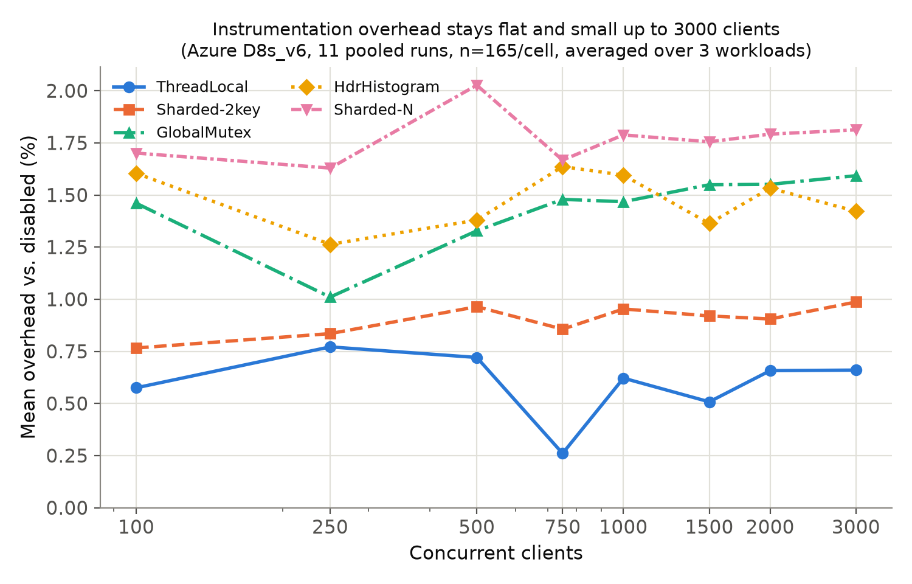
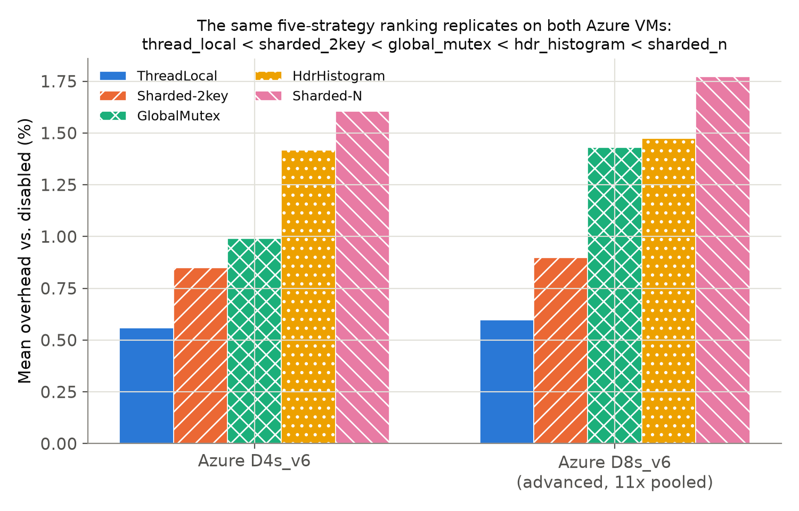
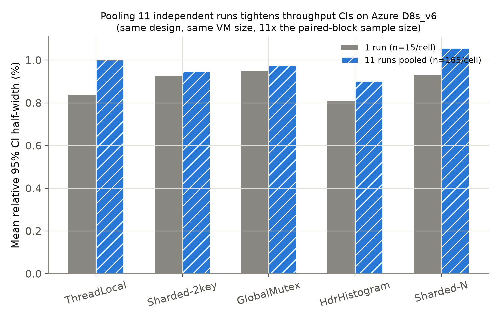

# Observability Overhead Under Concurrency in an In-Memory Key-Value Store: An RMIT Measurement Study

*Draft. Experiments are complete: 25,200 RMIT runs on two dedicated Azure VM
configurations — 1,440 on a single `Standard_D4s_v6` and 23,760 on eleven
independent `Standard_D8s_v6` runs pooled together (§4c: ten on
separately-provisioned VMs plus the original single validation run, folded
in as an eleventh replicate rather than left unused). Every table value,
figure, and quoted statistic in §4-§7 regenerates from committed scripts
(`scripts/paper_tables.py`, `generate_paper_figures.py`,
`compute_mde.py`, `compute_mde_clustered.py`, `simulate_mde.py`,
`combine_iterations.py`; see the Appendix); citations and page ranges have
been checked. Known remaining work: (1) a live A/A run (§7); (2) author list
and affiliation; (3) reformatting for the target venue. The scope is a
modest, reproducible empirical measurement study rather than a new method;
whether it suffices for a given journal is a venue question for a
supervisor or co-author.*

## Abstract

RustRedis compares six command-metrics instrumentation strategies
(disabled, global mutex, sharded-2key, thread-local, HdrHistogram,
sharded-N) under concurrent load in a Rust Redis-compatible in-memory
server. Throughput on lightly controlled machines drifts over a run, so
comparing strategies in blocks would confound strategy with machine state
(Abedi and Brecht, 2017). We instead use Randomized Multiple Interleaved
Trials (RMIT; Abedi, Heard, and Brecht, 2015), which shuffles the order of
every (strategy, concurrency, workload) configuration within each repetition,
with per-run machine-state logging and a paired within-block comparison
against a no-metrics baseline. We run it on a dedicated Azure `Standard_D4s_v6`
VM (1,440 runs, 48 configurations, 100-1000 concurrent clients, mixed
workload) and, independently, eleven times on `Standard_D8s_v6` VMs (23,760
runs pooled, 144 configurations, 100-3000 concurrent clients,
mixed/read-heavy/write-heavy workloads; ten separately-provisioned VMs across
three Azure regions plus one earlier validation run, folded in as an
eleventh replicate) — 25,200 runs in total. No two-state throughput pattern
appears in any of the 192 configurations, and every strategy costs 0.5%-1.8%
throughput on average and at most 2.3% at any concurrency level
(workload-averaged; single concurrency-by-workload cells reach 2.5%).
Pooling eleven independent D8s_v6 runs narrows, but does not fully resolve,
the five-strategy ranking: **ThreadLocal < Sharded-2key < GlobalMutex** are
each pairwise consistent across all eleven runs and both VM configurations
(sign-test p≈0.001 for both adjacent pairs), and **HdrHistogram <
Sharded-N** is consistent in 10 of 11 (p≈0.012); but **GlobalMutex <
HdrHistogram** — the one adjacent pair separating ranks 3 and 4 — agrees in
direction in only 8 of 11 runs (p≈0.23, *weaker* evidence than an earlier,
smaller pool of 10 runs gave for the same comparison), with a
0.04-percentage-point gap that stays below this design's own
detectable-effect floor even after pooling. A detectable-effect analysis —
closed-form, injected-effect simulation, and a cluster-aware bound that
treats each of the eleven runs as one data point rather than pretending 165
paired blocks are independent — puts the pooled design's resolution at
roughly 0.6%-0.75%, down from about 2% in a single run, so smaller
differences than that remain unresolved rather than absent. Pooling more
runs does not uniformly tighten every statistic: a simpler CI-width measure
on raw throughput (not the paired-ratio comparison above) actually widened
slightly with the eleventh run, a second demonstration that between-run
variance is real (§4c). We also document a failure that RMIT's own validity
checks do not catch: file-descriptor exhaustion that produced exactly
0 ops/sec with clean, well-formed output.

## Contributions

Randomized Multiple Interleaved Trials (RMIT) is Abedi, Heard, and Brecht's
technique (2015; Abedi and Brecht, 2017), and Laaber et al. (2019) already
combine RMIT-style sampling, bootstrap confidence intervals, A/A tests, and
simulation-based detectable-slowdown analysis for cloud microbenchmarks. Within
that frame, this paper contributes:

1. **An RMIT measurement of six instrumentation strategies on a live
   client-server workload (§4, §4b, §4c).** Abedi and Brecht (2017) replay
   traces collected by others, and Laaber et al. (2019) study single-method
   microbenchmarks and explicitly make no claims about load or stress tests.
   This paper applies RMIT to a network server under up to 3000 concurrent
   clients on 4-8 vCPUs, on two Azure VM configurations, and reports the
   overhead of six strategies (at most 2.3% per concurrency level,
   workload-averaged) and precisely which parts of their ranking replicate
   across both configurations and across all eleven pooled runs at
   conventional significance — ThreadLocal, Sharded-2key, and GlobalMutex
   pairwise resolved (p≈0.001 each) and Sharded-N costliest (p≈0.012) —
   versus which part agrees in direction but remains statistically
   unresolved even after 11x pooling (GlobalMutex vs. HdrHistogram, p≈0.23;
   §4c).
2. **A "clean but wrong" failure that RMIT's own checks do not catch (§3).**
   File-descriptor exhaustion produced exactly `0 ops/sec` with `rc=0` and a
   validly-formed result in every affected configuration — the opposite of
   the noisy, bimodal instability that RMIT's bimodality detector and
   confidence-interval width are built to flag. We did not find an analogous
   failure reported in the RMIT papers above.
3. **A detectable-effect analysis for this specific comparison, including
   the effect of replication (§7).** By a closed-form paired-design estimate
   and an injected-effect simulation on each dataset's own noise (following
   the injected-slowdown procedure of Laaber et al., 2019, adapted to
   within-machine paired blocks), a single run's design detects overheads of
   roughly 1-2% at 80% power, with a false-positive rate near the nominal 5%
   in the simulated null. The method is not new; it is reported so that "no
   significant difference" statements carry an explicit resolution floor.
4. **A worked demonstration, with the correct caveat, of how much pooling
   independent replicate runs actually helps — and does not (§4c).** Eleven
   independent D8s_v6 runs tighten the paired-ratio detectable-effect floor
   from about 2% to about 0.6%-0.75%, not naively but checked two ways: a
   cluster-aware estimate that treats each of the eleven runs (not each of
   the 165 individual paired blocks per cell) as one independent data
   point, and an empirical check for between-run variance large enough to
   invalidate a naive pooled estimate. The same section also shows this
   gain is not automatic or uniform: a differently-computed CI-width
   statistic on raw throughput widened, rather than tightened, when the
   eleventh run was added, and the weakest link in the ranking
   (GlobalMutex vs. HdrHistogram) went from a marginal lean to a weaker one
   as more data arrived, rather than resolving. Neither Abedi and Brecht
   (2017) nor Laaber et al. (2019) pool independent instances this way and
   check for the resulting clustering effect; Laaber et al.'s
   instance-based sampling treats different instances as the comparison
   groups themselves, not as replicates to be pooled.

## 1. Motivation and Related Work

Observability (per-command metrics/counters) is not free; the
implementation strategy for collecting it can dominate or disappear into
measurement noise depending on concurrency. This project asks two
questions that turn out to be almost independent of each other: (1) how
much does per-command metrics collection cost in a concurrent in-memory
key-value store, and which collection strategy costs least, and (2) can a
benchmark answer question (1) without a confound — such as drift in
machine state over the run — as large as the effect it is trying to measure
(§2).

**Benchmarking methodology.** Measured performance depends on setup
details experimenters rarely control or report (Mytkowicz et al., 2009),
so rigorous practice reports confidence intervals over repeated runs
(Georges et al., 2007; Kalibera and Jones, 2013) and randomizes factors
that should not matter but do — STABILIZER, for example, randomizes memory
layout (Curtsinger and Berger, 2013). Shared and cloud machines add
time-varying noise, both in compute (Maricq et al., 2018) and in the
network (Uta et al., 2020). Two designs address time-varying noise directly.
*Randomized Multiple Interleaved Trials (RMIT)* was proposed by Abedi,
Heard, and Brecht (2015) for WiFi experiments and shown by Abedi and Brecht
(2017) to be necessary in cloud environments: on replayed EC2 traces,
single-trial and multiple-consecutive-trial designs reported differences of
up to 37.8% between two identical systems, and even non-randomized
interleaving failed when the environment changed periodically. RMIT
interleaves trials of the alternatives under comparison in a fresh random
order each round, so drift lands on every alternative roughly equally.
*Duet benchmarking* (Bulej et al., 2020) instead runs the two artifacts
simultaneously so that shared noise cancels, reporting accuracy gains of
2.3x-82.4x; it does not suit a saturating client-server benchmark, where
two concurrent server instances would contend with each other, which is why
this paper interleaves sequentially. **The technique this paper applies in
§3 is RMIT; it is not new.** The closest prior work to this paper's overall
recipe is Laaber et al. (2019): RMIT-style "trial-based" sampling on the
same instances in randomized order, bootstrap confidence intervals, A/A
tests to measure false-positive rates, and a simulation-based
minimal-detectable-slowdown analysis (injecting slowdowns of 0.1%-1000%),
applied to 19 Java/Go microbenchmarks on three public clouds and a
bare-metal host. They find trial-based sampling markedly better than
comparing different instances — with five instances and five trials,
slowdowns in the 5%-10% range become detectable for most benchmarks — and
they explicitly make no claims about load or stress tests. For key-value and database
systems specifically, YCSB (Cooper et al., 2010) is the standard benchmark
suite, Reniers et al. (2017) survey under-reporting in NoSQL benchmark
practice, and Fruth et al. (2021) show that Java benchmark harnesses distort
measured tail latency — another instance of the harness, not the system,
dominating a result.

**Concurrency and observability costs.** Synchronization costs depend
heavily on hardware (David et al., 2013), which motivates comparing a
global lock, sharded counters, and per-thread accumulation. Sharded and
per-thread counting descend from low-contention counting networks (Aspnes et
al., 1994) and from the per-core "sloppy counters" used to remove kernel
counter contention (Boyd-Wickizer et al., 2010); replacing a global lock
with a concurrency-friendly structure is also what lifted Memcached's
throughput in MemC3 (Fan et al., 2013). Measurement tools can perturb the
contention they measure (Tallent et al., 2010), and production tracing
systems bound their own overhead by sampling because it is not negligible
(Sigelman et al., 2010) — both reasons to measure instrumentation overhead
directly rather than assume it away. HdrHistogram (Tene) supplies the
histogram recorder compared here.

**What is and is not new.** Not new: the RMIT technique (Abedi et al.,
2015; Abedi and Brecht, 2017), bootstrap confidence intervals over repeated
runs, A/A testing, and simulation-based detectable-effect analysis (Laaber
et al., 2019). What this paper offers, within that frame, is listed in the
Contributions section above: an RMIT measurement of six instrumentation
strategies on a live client-server workload, a "clean but wrong" failure
that RMIT's own checks do not catch, and an explicit detectable-effect
analysis for this specific comparison. Detailed per-paper notes are kept in
`docs/related_work_notes.md`.

## 2. Why Randomize Run Order

A benchmark that compares strategies must survive drift in machine state
over its wall-clock duration: thermal state, frequency scaling, background
activity, and co-tenants on shared hosts. If all repetitions of one
configuration run back to back before the next begins, a slow window that
lands during one configuration's block is statistically indistinguishable
from that configuration being genuinely slow (or, for a comparison against a
baseline, from a real overhead). The literature documents that this is not
hypothetical: on replayed EC2 traces, single-trial and
multiple-consecutive-trial designs reported differences of up to 37.8%
between two identical systems (Abedi and Brecht, 2017), and seemingly
innocuous, unrandomized setup differences silently produce wrong
conclusions across architectures and compilers (Mytkowicz et al., 2009).

This project therefore randomizes from the start. Every repetition (a
"block") runs all (strategy, concurrency, workload) configurations once in a
fresh random order, so any drifting condition is spread across strategies
rather than concentrated on one. The comparison the design makes valid is the
paired within-block ratio of each strategy's throughput to the `disabled`
baseline's in the same block: every strategy in a block saw the same
conditions, so a condition that slowed the block slows numerator and
denominator alike (§3, §4).

This paper does not include a fixed-order run on these machines, so it does
not measure how much run order would have mattered here; the case for
randomizing rests on the cited literature and on the standard argument above
(see §7).

## 3. The Design: RMIT

Randomized Multiple Interleaved Trials (RMIT) — the technique applied in
this section — is not new to this paper; it was proposed by Abedi, Heard,
and Brecht (2015) and shown to be necessary in cloud environments by
Abedi and Brecht (2017), as a fix for the class of problem §2 describes
(see §1 for the full comparison to those papers and to Laaber et al.
(2019), who apply the same technique with bootstrap confidence intervals to
cloud microbenchmarking). This project's specific application:

- Independent random permutation of the full (strategy x concurrency)
  matrix per repetition (`scripts/run_rmit_experiment.py`).
- Server restarted before every run (unavoidable once order is no longer
  strategy-grouped — every run is potentially a strategy switch).
- Machine-state snapshot logged immediately before every run
  (`scripts/system_state.py`): CPU frequency, thermal-zone temperature,
  memory/swap, load average, AC/battery status (fields degrade to `null`
  when unavailable, e.g. no thermal sensors or battery on a cloud VM).
- Two hardware targets (both Azure, same VM family), chosen to check that
  the overhead results are not specific to one VM size:
  - **Cloud VM (v1)**: Azure `Standard_D4s_v6` (4 vCPU, 16GB RAM, Central
    India), provisioned solely for the run and deleted immediately after.
    6 strategies x 8 concurrency levels (100-1000) x 30 repetitions =
    1440 runs. Nothing else ran on this
    machine — no thermal sensors, no battery, no competing session.
  - **Cloud VM (v2, advanced)**: Azure `Standard_D8s_v6` (8 vCPU, 32GB
    RAM), same provision-run-delete pattern. Extends the design to a third
    dimension — 6 strategies x 8 concurrency levels (100-3000) x 3 workload
    types (mixed, read-heavy, write-heavy) x 15 repetitions = 2160 runs per
    VM — to find where strategies actually diverge (higher concurrency) and
    whether read/write mix changes which strategy is cheapest (it doesn't;
    see §4b). This first run (Central India, seed 271828182) is pooled with
    ten further independent repeats of the identical design across four
    separately-provisioned D8s_v6 VMs in three Azure regions (two VMs in
    Central India, one in South India, one in West US 3; each VM ran two or
    three of the ten repeats back to back), each with its own random seed —
    eleven runs, 23,760 pooled runs in total (§4c).

**A methodological pitfall worth recording**: the first attempt at the v2
run silently failed above roughly c=1000 — every run reported exactly
`0 ops/sec` with no error, rc=0, and a validly-formed JSON output. The
cause was the default open-file-descriptor soft limit (1024 on a fresh
Ubuntu VM) being far below the concurrency levels being tested; every
client thread's `connect()` failed, and the benchmark client counts
connection failures as errors internally rather than aborting, so the run
"succeeded" while measuring nothing. `run_rmit_experiment.py` now raises
its own `RLIMIT_NOFILE` toward the hard limit once at startup (inherited
by both the server and client subprocesses it spawns) and warns loudly if
the achieved limit still can't cover the requested concurrency. This is
recorded here because it is exactly the kind of failure RMIT's own
validation (§2's reasoning about drifting machine state) does not catch —
a systematic, order-independent failure produces suspiciously *clean*,
*consistent* zeros, not the noisy instability that randomizing run order
guards against. The timing/smoke test that caught it
(comparing a 1-repetition dry run's per-run throughput values by eye
before committing to the full 15-repetition run) is why it's worth always
inspecting raw per-run output before trusting an aggregate.

## 4. Results on the RMIT Machines

The Azure D4s_v6 dataset and its analysis are in the repo:
`experiments/azure_d4s_v6/`, with `raw_data_rmit.csv`,
`rmit_analysis.json`, `rmit_analysis_summary.csv`, and `metadata_rmit.json`.

**No two-state pattern.** `scripts/analyze_rmit_results.py`
flags a configuration as two-state when its throughput distribution
splits into two clusters at least 1.8x apart with each holding >=15% of
samples. Result: **0 of 48 configurations flagged.** The detector is a
simple largest-gap heuristic (§5), so this rules out large, well-separated
state splits but not subtler multimodality.

**Run-to-run variability is low.** Relative 95% bootstrap CI width on
throughput (width / median): mean 0.0091 and maximum 0.0175 across the 48
configurations. Variability this small (mean relative CI width 0.9%-1.8%
across both datasets; §4b adds D8s_v6) is what makes the sub-2% overhead
comparisons below meaningful.

**Instrumentation overhead is small, consistent, and doesn't cross over.**
Paired within-repetition-block throughput ratios vs. the `disabled`
baseline (the RMIT-valid comparison — it controls for whatever
time-varying condition affected block N, since every strategy in block N
saw the same condition). For each (strategy, concurrency[, workload])
cell, overhead is 1 − the *median* paired-block throughput ratio (medians
are this project's primary point estimate throughout, per
`scripts/analyze_rmit_results.py`); "mean overhead" in every table below
is the arithmetic mean of those per-cell medians across cells:

| Strategy | Azure D4s_v6 mean overhead |
|---|---:|
| thread_local | 0.56% |
| sharded_2key | 0.85% |
| global_mutex | 0.99% |
| hdr_histogram | 1.42% |
| sharded_n | 1.60% |

`thread_local` is cheapest and `sharded_n` most expensive on average, with
`sharded_2key` second (see §4b for the D8s_v6 counterpart and which parts of
the ranking replicate across the two VMs). Overhead is small (strategy means
at most 1.60%). Per-cell median paired ratios ranged from 0.9771 to 1.0051 —
the one cell slightly above 1.0 is noise (a strategy edging out `disabled` in
that cell), not a reversal of the overall ranking. The largest single-cell
overhead is 2.29% (`sharded_n` at 600 clients).

## 4b. Extending the Design: Workload Type and Higher Concurrency

The dataset in §4 only exercises the 50/50 mixed workload and tops out at
1000 concurrent clients. It did not find where (or whether) strategies
actually diverge, and did not test whether read/write mix interacts with
instrumentation cost. The advanced design (Azure `Standard_D8s_v6`) closes
both gaps: 6 strategies x 8 concurrency levels (100-3000) x 3 workloads
(mixed, read-heavy, write-heavy) x 15 repetitions = 2160 runs per run. This
section reports the pooled result of running that design independently
eleven times (23,760 runs total, n=165 paired blocks per cell instead of
15); §4c describes the pooling method and exactly how much it improves
resolution over one run — and where it does not.

**Still no two-state pattern, at 3x the concurrency ceiling, 3x the workload
coverage, and 11x the data.** 0 of 144 configurations flagged two-state; the
closest call anywhere in the pooled data is a 1.34x gap (against the 1.8x
threshold), with the minority side a single outlier run out of 165. Mean
relative 95% CI width: 0.0194 (max 0.0552) — *wider*, not narrower, than
both the D4s_v6 run (0.0091) and a single D8s_v6 run (0.0177). As §4c shows,
this particular CI-width statistic is not a reliable indicator of how much
pooling helps: it is dominated by genuine run-to-run variance rather than by
having too few samples, and adding the eleventh run happened to widen it.

**Overhead stays small and flat all the way to c=3000** — there is no
concurrency level where any strategy's cost jumps or the ranking
qualitatively changes:

| Concurrency | global_mutex | hdr_histogram | sharded_2key | sharded_n | thread_local |
|---:|---:|---:|---:|---:|---:|
| 100 | 1.46% | 1.60% | 0.77% | 1.70% | 0.58% |
| 250 | 1.01% | 1.26% | 0.84% | 1.63% | 0.77% |
| 500 | 1.33% | 1.38% | 0.96% | 2.03% | 0.72% |
| 750 | 1.48% | 1.64% | 0.86% | 1.67% | 0.26% |
| 1000 | 1.47% | 1.60% | 0.95% | 1.79% | 0.62% |
| 1500 | 1.55% | 1.36% | 0.92% | 1.76% | 0.51% |
| 2000 | 1.55% | 1.53% | 0.91% | 1.79% | 0.66% |
| 3000 | 1.59% | 1.42% | 0.99% | 1.81% | 0.66% |

(overhead relative to `disabled`, averaged over the 3 workloads at each
concurrency level, pooled across 11 independent runs.)



**Figure 1.** Mean overhead vs. `disabled` for each strategy across the full
100-3000 concurrency range (Azure D8s_v6, 11 pooled runs, n=165 paired
blocks per cell, averaged over the three workload types). Generated directly
from `experiments/azure_d8s_v6/pooled/rmit_analysis.json` by
`scripts/generate_paper_figures.py` — the same source as the table
above, not a separate hand-plotted figure. Compared to the single-run version
of this figure (superseded as the paper's primary source, but pooled in as
one of the eleven runs; see `experiments/azure_d8s_v6/run_00/` for
provenance), the line-to-line jaggedness is visibly reduced but not gone —
consistent with §4c's finding that pooling tightens the paired-ratio
resolution by roughly 3x, not to zero, while a differently-computed
raw-throughput CI statistic does not tighten at all (previous paragraph).

`thread_local` never exceeds 0.8% at any concurrency level tested;
`sharded_n` never exceeds 2.03% workload-averaged (single
concurrency-by-workload cells reach up to 2.54%). The server's own
throughput roughly saturates rather than collapses under load — disabled
baseline throughput peaks near 309k ops/sec at c=250, then drops from
~288-294k at c=100 to ~255-264k at c=3000 (about a 10-13% decline, pooled
across the 11 runs) while p99 latency rises from under 1ms to 76-80ms, a
graceful saturation curve rather than a cliff.

**Workload type does not change which strategy is cheapest.** Averaging
overhead across all 8 concurrency levels for each workload:

| Strategy | Mixed | Read-heavy | Write-heavy |
|---|---:|---:|---:|
| thread_local | 0.52% | 0.63% | 0.64% |
| sharded_2key | 0.86% | 0.95% | 0.89% |
| global_mutex | 1.37% | 1.50% | 1.43% |
| hdr_histogram | 1.49% | 1.56% | 1.38% |
| sharded_n | 1.73% | 1.87% | 1.72% |

The point-estimate ranking — `thread_local` < `sharded_2key` < `global_mutex`
< `hdr_histogram` < `sharded_n` — is the same in all three workloads. The
top two and bottom one are comfortably separated in every workload; the
`global_mutex`-vs-`hdr_histogram` gap is not — 0.12, 0.06, and -0.05
percentage points in mixed, read-heavy, and write-heavy respectively
(negative in write-heavy means `global_mutex` is nominally *more* expensive
there), all well below this design's detectable-effect floor (§4c, §7),
consistent with that pair being a directional lean rather than a resolved
difference (§4c) even before splitting by workload. This is still a
negative result worth stating plainly for the resolved parts of the
ranking: read/write mix was a plausible place for instrumentation cost to
interact with workload (e.g. if a strategy's overhead were dominated by
write-path lock contention, a write-heavy workload might expose it more),
and for `thread_local`, `sharded_2key`, and `sharded_n` it does not.

**The "crossovers" the analysis script flags are noise, not signal — and
with enough data, it stops flagging any.** `scripts/analyze_rmit_results.py`'s
crossover detector (which strategy has the highest median throughput at
each concurrency level) reports **0** leader changes across the 3 workloads
with the 11-run pooled data, down from 4 with 10 runs pooled and 6 in the
single-run version. Given every strategy's overhead is within about 2% of
`disabled` at every concurrency level (previous table), the crossovers seen
in smaller samples were sub-2%, sub-CI-width leader swaps — exactly what
pure measurement noise looks like. That the count fell monotonically as more
independent data was added (6 to 4 to 0), rather than stabilizing on a
nonzero number, is itself evidence the earlier crossovers were noise: a
real crossover would be expected to survive more data, not disappear.

**Which parts of the ranking are consistent across the two VM
configurations.** It's worth being precise about which parts of "no
significant difference" actually mean "we detected no difference" versus
"any difference here is too small for this design to see" (see the
minimum-detectable-effect numbers in §7). Ranking all six strategies by mean
overhead within each dataset (§4's table and this section's workload table)
gives:

| Rank | Azure D4s_v6 | Azure D8s_v6 (11x pooled) | Confidence (§4c sign test) |
|---:|---|---|---|
| 1 (cheapest) | thread_local | thread_local | resolved (11/11 runs, p≈0.001) |
| 2 | sharded_2key | sharded_2key | resolved (11/11 runs, p≈0.001) |
| 3 | global_mutex | global_mutex | not resolved (8/11 runs, p≈0.23) |
| 4 | hdr_histogram | hdr_histogram | not resolved (same test as rank 3) |
| 5 (most expensive) | sharded_n | sharded_n | resolved (10/11 runs, p≈0.012) |



**Figure 2.** The same ranking as a chart: both VM configurations agree on
strategy order, though (per the table above and §4c) only ranks 1, 2, and 5
are resolved at conventional significance — ranks 3 and 4 agree in point
estimate but not at a level distinguishable from chance, and less so than
an earlier, smaller pool of 10 runs suggested. Generated by
`scripts/generate_paper_figures.py` from each dataset's own
`rmit_analysis.json`, using the same per-cell ratio-median statistic as
every table in §4 and §4b (verified to reproduce those tables' values
exactly before this script was trusted for the figure).

**The top two and bottom one rank are unanimous across the two VM
configurations and, more strongly, across all eleven individual D8s_v6 runs;
the middle pair remains a weaker, unresolved signal that got weaker, not
stronger, with more data.** §4c checks this directly with adjacent-rank
sign tests: does the cheaper-ranked strategy of each pair actually come out
cheaper in each individual run's own overall mean overhead? `thread_local`
beats `sharded_2key` in 11 of 11 runs and `sharded_2key` beats `global_mutex`
in 11 of 11 (both two-sided sign-test p≈0.001), and `hdr_histogram` is
beaten by `sharded_n` in 10 of 11 (p≈0.012) — all three comfortably
resolved and all agreeing with D4s_v6. `global_mutex` comes in below
`hdr_histogram` in only 8 of 11 runs (p≈0.23) — the same direction as
D4s_v6 and as the pooled point estimate (1.43% vs. 1.47%), but weaker
evidence than the 8-of-10 result (p≈0.11) an earlier, smaller pool gave for
this exact comparison, because the eleventh run happened to disagree.
**The honest reading is that the top-3 (in pairwise order) and the bottom
rank are now resolved, and the rank-3-vs-4 comparison is not, with no
trend toward resolving as more data was added** — this is itself useful
information: pooling more data narrowed the remaining doubt for four of the
five adjacent comparisons, and for the fifth it showed the apparent lean
was, if anything, less trustworthy than a smaller sample suggested, which
is a more honest outcome than either "resolved" or silence would have been.
We read the resolved comparisons as a small, consistent effect (plausibly
because per-thread accumulation and a two-entry concurrent map avoid
synchronization cost the other three strategies pay, and the per-key
`sharded_n` map's bookkeeping cost scales with the 10,000-key workload in a
way the others don't; we did not test the mechanism), distinct from the
crossover claims above, which really are noise even in the pooled data. The
`global_mutex`-vs-`hdr_histogram` ordering remains a real but still-open
question, not a resolved finding. The caveat on all of this is that the two
VM configurations are the same VM family and OS, differing in size, region
mix, and workload coverage, so they are replicates of the comparison across
VM size and geography but not independent tests across hardware families or
clouds (§7).

## 4c. How Much Replication Helps, and How to Account for It Correctly

The single-VM advanced dataset (§4b's design, run once) could not tell
`global_mutex` and `hdr_histogram` apart — their overhead gap was smaller
than that dataset's own minimum detectable effect. Rather than accept that
as a permanent limitation, we reran the identical design independently ten
more times, across four separately-provisioned D8s_v6 VMs in three Azure
regions (Central India x2, South India, West US 3; §3) — eleven runs of
2,160 each, 23,760 runs pooled in total, counting the original run.
`scripts/combine_iterations.py` pools all eleven into one dataset: each
run's `block_id` (1-15) is offset by its run index before concatenation, so
the paired within-block comparison (§2) still only ever pairs a strategy
against `disabled` within the single run that block actually came from —
pooling adds independent replicates of the comparison, it does not let
blocks from different runs or times get paired together.

**The naive gain looks like more than it is.** Treating the pooled n=165
paired blocks per cell as 165 independent samples and plugging them into the
same formula as §7 (`MDE ≈ (z_.975+z_.80) × SD / sqrt(n)`) gives a
detectable-effect floor of about 0.58%, roughly 3.6x tighter than one run's
2.1% — close to the sqrt(11) ≈ 3.32x that pure sample-size scaling
predicts. But the 165 blocks are not 165 independent draws: they are 11
independent runs, each contributing 15 *correlated* within-run blocks (the
same run's blocks share whatever that VM's actual hardware, noisy
neighbors, and network path happened to be). Treating them as 165
independent points overstates how much the pooled sample actually tells
you about behavior that generalizes across VM instances, in the same way
that surveying 165 people from 11 households and treating it as 165
independent opinions overstates what you know about the wider population.

**A cluster-aware check.** For every (strategy, concurrency, workload)
cell, `scripts/compute_mde_clustered.py` first collapses each run's 15
blocks to that run's own median ratio — one number per run per cell, 11
numbers per cell — then computes the detectable-effect floor from the
between-run spread of those 11 numbers, using n=11 (the true number of
independent replicates) rather than n=165. This gives a more conservative
**0.69%**. We also checked empirically whether the between-run variance is
large enough to matter: for three representative cells, the standard
deviation of the 11 per-run median ratios (0.0038-0.0076) is comparable to,
not many times larger than, a single run's own sampling error at n=15
(SD/sqrt(15), 0.0046-0.0075) — meaning independent runs do differ from each
other by a real, non-negligible amount, but not so much that pooling is
invalid, only that it should be treated conservatively. The injected-effect
simulation (§7's method, rerun on the pooled dataset) independently arrives
at **0.75%** power-80% detectable effect, agreeing with the cluster-aware
bound to within its simulation grid resolution and confirming the naive
0.58% figure is a genuine but modest overstatement of precision, not a
qualitatively wrong one.



**Figure 3.** Mean relative 95% bootstrap CI half-width on raw throughput,
per strategy, comparing one D8s_v6 run (n=15/cell) against the 11-run pool
(n=165/cell). Unlike the paired-ratio MDE above, which tightens by roughly
3x, this statistic does not tighten with pooling — it widens, for every one
of the five strategies. This is the same between-run-variance effect
described above, seen starkly from a different statistic: this bootstrap CI
is computed on raw per-cell throughput medians pooled across all 11 runs, so
its width reflects the *total* spread in the data, including genuine
run-to-run differences that additional within-run samples cannot shrink
away — and the eleventh run (the original validation run, run on a
different date under different transient cloud conditions than the
ten-run batch) evidently added more of that spread than it removed. The
paired-ratio MDE in this section tightens instead because it is a
between-strategy comparison *within* each block, which cancels out
per-block conditions (including much of the per-run effect) before the SD
is even computed — a different, more favorable statistic for exactly the
reason RMIT's paired design was adopted in the first place (§2). The
contrast between the two statistics is itself the finding: whether pooling
"helps" depends entirely on which quantity is being estimated, not on
whether more data was collected.

**Bottom line for practitioners repeating this kind of study:** replication
across independent VM instances helps for the comparison that matters here
(the paired strategy-vs-baseline ratio) — 0.58-0.75% instead of ~2% is a
real, roughly 3x improvement in what a design like this can resolve — but
the naive arithmetic (just divide by sqrt of the pooled sample size) is
optimistic by about 20% here, and would be more optimistic still if
between-instance variance were larger relative to within-instance noise. It
does not help, and can even look worse, for a differently-constructed
statistic on the same underlying data (Figure 3), and it does not
automatically resolve every open comparison: the weakest link in this
paper's ranking (`global_mutex` vs. `hdr_histogram`) went from a marginal
lean at n=10 (p≈0.11) to a weaker one at n=11 (p≈0.23) when the eleventh
run happened to disagree — exactly the kind of outcome a rigorous pooling
method should be able to report honestly rather than paper over. Reporting
a cluster-aware bound alongside the naive one, checking empirically that
between-cluster variance is not dominant, and tracking whether new
replicates strengthen or weaken each specific claim (not just the average)
costs a few extra scripts and is worth doing before trusting a
pooled-sample result at face value.

## 5. Machine-State Logging and What It Can Check

Every row of each `raw_data_rmit.csv` carries a machine-state snapshot taken
immediately before the run (`scripts/system_state.py`): mean and maximum
CPU frequency, governor, thermal-zone temperature, memory and swap
availability, 1/5/15-minute load average, and AC/battery status (fields are
`null` where the hardware lacks them, e.g. thermal sensors and batteries on
the Azure VMs). These logs allow post-hoc checks that a run was not
disturbed. Load averages on the dedicated Azure VMs are high (1-minute
medians 8.5 on D4s_v6 and 14.1 on D8s_v6, pooled across all eleven runs,
range 3.4-38.3), but there they largely reflect the benchmark's own hundreds
to thousands of client threads rather than outside interference.

The two-state check in `scripts/analyze_rmit_results.py` is a deliberately
simple heuristic: split each configuration's throughputs at their largest gap
and flag it if the two clusters' medians are at least 1.8x apart and each
holds at least 15% of the samples. It flagged 0 of 192 configurations (0 of
48 on Azure D4s_v6, 0 of 144 on the 11-run-pooled Azure D8s_v6 dataset). The
closest calls in the pooled data are still far from the threshold — the
largest observed gap ratio is 1.34x, against the 1.8x cutoff, with the
minority cluster in each case a single outlier run rather than a real second
state. Because it is a largest-gap heuristic rather than a mixture-model fit,
it could still miss subtler multimodality or state shifts smaller than 1.8x;
the paired within-block design does not depend on it, since it compares
strategies within blocks whatever the machine state was.
`scripts/hardware_hypothesis_check.sh` exists to test thermal-throttling,
governor-instability, and memory-pressure hypotheses directly if a
machine-state explanation for any future anomaly is needed.

## 6. Practical Implications

Two audiences can act on this work directly.

**For anyone choosing a metrics-collection strategy for a similar
concurrent server:** the overhead of per-command observability here is
small enough (at most 2.3% at any concurrency level, workload-averaged, on
both VM configurations; single cells reach 2.5%) that "does instrumentation cost too much"
is not, by itself, a reason to leave it disabled in production for a system
in this class (single-process, in-memory, network-bound). Within that
small budget, the choice of *strategy* still matters in a stable way:
`thread_local` accumulation is the cheapest strategy on both VMs we
tested and is the safe default when overhead must be minimized; if
per-command latency histograms (not just counters) are required,
`hdr_histogram` costs more but the extra cost (roughly 1.4-1.5
percentage points versus `disabled` on average) buys detailed
tail-latency visibility that flat counters cannot provide, so it is a
reasonable trade rather than a strategy to avoid. `sharded_n` — a
concurrent map keyed by the full logical (data) key, so it holds one entry
per distinct key (up to 10,000 in this workload) — showed no throughput
advantage over a plain `global_mutex` at the concurrency levels tested
(4-8 vCPUs, up to 3000 clients) and had the highest mean overhead on both
VMs; the extra cost of per-key entries is not paying for itself here, though we
did not test why, and it would only be worth revisiting at core counts or
contention levels well beyond what this project tested (see §7's scope
limits). `sharded_2key`, by contrast, is keyed by command name (two entries,
GET and SET) and was second-cheapest on both VMs.

**For anyone designing a similar concurrency benchmark:** the more
general and arguably more durable finding is methodological, not about
this server. A fixed-order design (finish every repetition of
configuration A, then move to configuration B) cannot distinguish "this
configuration is unstable" from "the machine happened to be in a slow
state while this configuration was running" — §2 cites evidence that this
is a real failure mode (differences of up to 37.8% between identical
systems). Randomizing configuration order per repetition (RMIT; Abedi and
Brecht, 2017) is a cheap fix — no new hardware, no new instrumentation, just
a different loop order — that makes a drifting environment land on every
configuration rather than on one, so that within-block paired comparisons
stay valid. (This paper did not run a fixed-order comparison on these
machines, so it does not quantify the benefit here; §7.) Any benchmark that
compares more than one configuration under conditions that can drift
over the run's wall-clock duration (thermal state, background load,
cache warmth, OS scheduling decisions) is exposed to the same
confound, independent of what is being measured — this is a general
argument for randomized-order benchmarking, not a claim specific to
metrics-collection strategies or to this codebase. §3's file-descriptor
pitfall is a second, separate, general lesson: a systematic
infrastructure failure can produce clean, low-variance, entirely
*consistent* wrong numbers, which is the opposite signature of the
noisy instability a randomized design is built to catch — no
benchmark design substitutes for inspecting a small dry run's raw
per-sample output by eye before trusting an aggregate.

## 7. Limitations

- **No fixed-order comparison.** Every dataset here uses RMIT, so the paper
  cannot say how much a blocked design would have distorted these machines'
  results; the argument for randomizing rests on the cited literature (§2).
  The claims supported are the RMIT-based overhead measurements themselves
  (§4, §4b) and the resolution floor of that design (below).
- No live A/A experiment (running the identical configuration twice) was
  performed; the false-positive rate reported in this section comes from a
  resampling-based simulated null, which validates the test's calibration
  under the observed noise but not the experimental procedure end to end.
  Laaber et al. (2019) run A/A tests as a standard check; a live A/A run
  (for example `disabled` against `disabled` in the same RMIT blocks) is the
  natural next step.
- §1's related-work discussion covers the closest benchmarking-methodology
  papers found, but is not a
  systematic literature review; a venue-specific submission should widen
  the search, e.g. into published YCSB-based throughput comparisons of
  Redis-class systems, which were not individually surveyed. Abedi and
  Brecht (2017) and Laaber et al. (2019) were read in full; the other cited
  papers were checked at abstract level (Bulej et al., 2020; Maricq et al.,
  2018; Uta et al., 2020) or by their well-known contribution.
- This project's benchmark client is custom-built rather than YCSB
  (Cooper et al., 2010), the de facto standard for KV-store benchmarking.
  The workload types (mixed/read-heavy/write-heavy, §3) are conceptually
  similar to YCSB's core workloads but are not YCSB itself, so this
  paper's absolute throughput numbers are not directly comparable to
  published YCSB results for other systems; the paired, within-block
  overhead ratios (§4, §4b) are unaffected by this since they compare
  this project's own strategies against its own `disabled` baseline using
  the same client.
- The server process is restarted before every run, but OS-level state
  (page cache, TCP port reuse, kernel socket buffers) still carries over
  between runs on the same machine — full OS-level isolation (e.g., a
  fresh VM per run) was out of scope.
- Client and server always share the same machine (no `taskset` pinning
  or second-machine load generator was used for any RMIT dataset); at the
  highest concurrency levels tested (1000 clients / 4 vCPUs on the first
  cloud VM, 3000 clients / 8 vCPUs on the second) this is a genuine
  thread-oversubscription stress test, not a clean saturation curve
  measuring the server in isolation from its own load generator.
- Two hardware configurations were tested: Azure `Standard_D4s_v6` (one VM)
  and `Standard_D8s_v6` (eleven independent runs, four of them
  separately-provisioned VMs across three Azure regions plus one earlier
  validation run, pooled; §4c). Both are the same VM family and x86-64 OS
  image, so they are replicates of the comparison across VM size, region,
  and workload coverage, not independent tests across hardware families,
  cloud providers, or architectures, and no claim is made about behavior on
  hardware with substantially different core counts, NUMA topology, or
  non-x86 architectures. All VMs ran on shared cloud infrastructure whose
  noisy-neighbor behavior is not observable from the guest; §4c's finding
  that between-run variance is real and non-negligible — and that it can
  widen a raw-throughput CI statistic even as it barely moves the
  cluster-aware paired-ratio floor — is itself indirect evidence that such
  effects are present (whether from noisy neighbors, underlying hardware
  differences, or network path).
- The advanced design (§4b, §4c) uses 15 repetitions per configuration per
  run vs 30 for the D4s_v6 run; pooling eleven D8s_v6 runs brings the total
  paired-block sample per cell to 165, exceeding D4s_v6's 30, but as §4c
  explains, those 165 samples are not fully independent, so the honest
  comparison is closer to "11 independent replicates vs. D4s_v6's 1" than
  "165 samples vs. 30."
- **What "no significant difference" can and can't rule out.** Three
  estimates of the smallest overhead this design can detect, all computed
  from committed scripts and all reported so that "no significant
  difference" claims carry an explicit floor rather than an implicit one.
  (a) A closed-form paired-design estimate, `MDE ≈ (z_.975 + z_.80) × SD /
  sqrt(n)` (80% power, 95% confidence), from the pooled SD of per-block
  strategy/`disabled` throughput ratios (`scripts/compute_mde.py`):
  **0.9% on Azure D4s_v6** (SD 0.017, n=30 reps/cell), **2.1% on a single
  Azure D8s_v6 run** (SD 0.029, n=15), and **0.58% on the 11-run D8s_v6 pool**
  treating all 165 paired blocks as independent (SD 0.026, n=165) — this
  last figure is optimistic; see (c). (b) An injected-effect simulation
  adapted from Laaber et al. (2019): for each cell, remove its own effect,
  inject an overhead x, resample n paired ratios, and test whether the 95%
  percentile-bootstrap CI of the median (the interval
  `analyze_rmit_results.py` reports) excludes 1 (`scripts/simulate_mde.py`;
  400 simulations x 400 bootstrap resamples per cell and x, seed 0). At
  x = 0 the test rejects in 5%-6% of simulations (nominal 5%). Pooled power
  reaches 80% at about **1.0%-1.5%** on Azure D4s_v6, **2.0%** on a single
  D8s_v6 run, and **0.75%** on the 11-run pool. (c) Because the pooled
  n=165 is really 11 independent runs of 15 correlated within-run blocks
  each, `scripts/compute_mde_clustered.py` collapses each run's 15
  blocks to one median per cell and computes the MDE from the between-run
  spread of those 11 numbers (n=11, not 165): **0.69%** — close to (b)'s
  simulated figure and about 19% more conservative than (a)'s naive pooled
  figure, confirming the optimism in (a) is real but modest (§4c has the
  full derivation, an empirical check that between-run variance is not
  large enough to invalidate pooling outright, and a demonstration that a
  differently-computed CI-width statistic on the same pooled data actually
  widened rather than tightened). Most of the adjacent-strategy gaps in §4
  and §4b's tables (often well under 0.2 percentage points among ranks 3-4)
  are below even the most favorable of these floors. This means "no
  significant crossover" and "adjacent strategies are statistically
  indistinguishable at a given concurrency level" should be read as *this
  design's power is exhausted at gaps below roughly 0.6-2%, depending on how
  much data is pooled and how conservatively that pooling is accounted
  for*, not as *no difference exists*. The claims in §4b and §4c that
  survive this caveat at conventional significance are that `thread_local`
  is cheapest, `sharded_2key` second, and `sharded_n` costliest, confirmed
  both by point estimates on both VM configurations and by adjacent-rank
  sign tests across all eleven individual D8s_v6 runs (p≈0.001, p≈0.001,
  and p≈0.012 respectively). The `global_mutex`-vs-`hdr_histogram` gap
  (ranks 3-4) is only directionally consistent (8 of 11 runs, p≈0.23 —
  weaker than the p≈0.11 an earlier, smaller pool of 10 runs gave for the
  same comparison) and remains below every MDE estimate above — a real
  lean that did not resolve as more data was added, not a resolved
  finding.

## 8. Conclusion

This paper measured the throughput cost of six per-command metrics
strategies in a Rust in-memory key-value server using Randomized Multiple
Interleaved Trials (Abedi, Heard, and Brecht, 2015; Abedi and Brecht, 2017)
on a dedicated Azure D4s_v6 VM and, independently, eleven times on D8s_v6
VMs pooled together, for 25,200 runs and 192 configurations in total, from
100 to 3000 concurrent clients and three workload mixes. No two-state
throughput pattern appeared, and every strategy costs a small, flat overhead
(0.5%-1.8% on average, at most 2.3% at any concurrency level,
workload-averaged), with `thread_local` cheapest, `sharded_2key` second, and
`global_mutex` third on both VM configurations and across all eleven
individual D8s_v6 runs (adjacent-rank sign-test p≈0.001 for each of those
two comparisons) — the ranking's most robust finding, together with
`sharded_n` costliest (p≈0.012). The one comparison that did *not* resolve
with more data is `global_mutex` vs. `hdr_histogram` (ranks 3-4): it agrees
in direction 8 times out of 11 (p≈0.23), *weaker* evidence than an earlier,
smaller pool of 10 runs gave for the same pair (p≈0.11), and stays below
this design's own detectable-effect floor even after pooling — a lean, not
a resolved result, and a useful reminder that adding data does not
guarantee every open question resolves in the expected direction. That
floor itself improved substantially with pooling for the paired-ratio
comparison that matters most — from about 2% for a single D8s_v6 run to
about 0.6-0.75% for the eleven pooled together, a genuine roughly-3x gain,
though a naive n=165 calculation overstates it by about 19% (§4c) because
the 165 paired blocks are 11 independent runs' worth of correlated samples,
not 165 independent ones. A differently-constructed statistic on the same
pooled data (raw-throughput CI width, Figure 3) did not improve at all — it
widened — which is itself the clearest demonstration in this paper that
"pooling more data helps" is a claim about a specific statistic, not a
universal property of adding runs. Two methodological points generalize
beyond this server: randomizing configuration order per repetition keeps a
drifting environment from concentrating on one configuration (§2, §6), and
a systematic infrastructure failure — here, file-descriptor exhaustion —
can produce clean, uniform, wrong results that RMIT's own checks do not
flag, so a small dry run's raw output should be inspected before trusting
an aggregate (§3). Natural next steps are a live A/A run, a second-machine
load generator to remove client-server co-location, and additional
workloads and hardware.

## References

Author-year citations throughout this paper (e.g. "Abedi and Brecht,
2017") refer to the entries below, alphabetized by first author. Authors,
titles, venues, years, and page ranges were checked against publisher,
dblp, or USENIX/ACM records via search; entries without page ranges
(Boyd-Wickizer et al., Sigelman et al., Tene) are not paginated in the
form cited. Convert to the target venue's required style (numbered IEEE,
ACM reference format, etc.) at submission time — a mechanical
reference-manager step.

1. Abedi, A. and Brecht, T. (2017). Conducting Repeatable Experiments in
   Highly Variable Cloud Computing Environments. In *Proceedings of the
   8th ACM/SPEC International Conference on Performance Engineering
   (ICPE '17)*, 287-292.
2. Abedi, A., Heard, A., and Brecht, T. (2015). Conducting Repeatable
   Experiments and Fair Comparisons using 802.11n MIMO Networks. *ACM
   SIGOPS Operating Systems Review*, 49(1), 41-50.
3. Aspnes, J., Herlihy, M., and Shavit, N. (1994). Counting Networks.
   *Journal of the ACM*, 41(5), 1020-1048.
4. Boyd-Wickizer, S., Clements, A. T., Mao, Y., Pesterev, A., Kaashoek,
   M. F., Morris, R., and Zeldovich, N. (2010). An Analysis of Linux
   Scalability to Many Cores. In *Proceedings of the 9th USENIX Symposium
   on Operating Systems Design and Implementation (OSDI '10)*.
5. Bulej, L., Horky, V., Tuma, P., Farquet, F., and Prokopec, A. (2020).
   Duet Benchmarking: Improving Measurement Accuracy in the Cloud. In
   *Proceedings of the ACM/SPEC International Conference on Performance
   Engineering (ICPE '20)*, 100-107.
6. Cooper, B. F., Silberstein, A., Tam, E., Ramakrishnan, R., and Sears,
   R. (2010). Benchmarking Cloud Serving Systems with YCSB. In
   *Proceedings of the 1st ACM Symposium on Cloud Computing (SoCC '10)*,
   143-154.
7. Curtsinger, C. and Berger, E. D. (2013). STABILIZER: Statistically
   Sound Performance Evaluation. In *Proceedings of the 18th
   International Conference on Architectural Support for Programming
   Languages and Operating Systems (ASPLOS '13)*, 219-228.
8. David, T., Guerraoui, R., and Trigonakis, V. (2013). Everything You
   Always Wanted to Know About Synchronization but Were Afraid to Ask.
   In *Proceedings of the 24th ACM Symposium on Operating Systems
   Principles (SOSP '13)*, 33-48.
9. Fan, B., Andersen, D. G., and Kaminsky, M. (2013). MemC3: Compact and
   Concurrent MemCache with Dumber Caching and Smarter Hashing. In
   *Proceedings of the 10th USENIX Symposium on Networked Systems Design
   and Implementation (NSDI '13)*, 371-384.
10. Fruth, M., Scherzinger, S., Mauerer, W., and Ramsauer, R. (2021).
    Tell-Tale Tail Latencies: Pitfalls and Perils in Database
    Benchmarking. In *Performance Evaluation and Benchmarking (TPCTC
    2021)*, Lecture Notes in Computer Science 13169, 119-134.
11. Georges, A., Buytaert, D., and Eeckhout, L. (2007). Statistically
    Rigorous Java Performance Evaluation. In *Proceedings of the 22nd
    ACM SIGPLAN Conference on Object-Oriented Programming Systems,
    Languages, and Applications (OOPSLA '07)*, 57-76.
12. Kalibera, T. and Jones, R. E. (2013). Rigorous Benchmarking in
    Reasonable Time. In *Proceedings of the 2013 International Symposium
    on Memory Management (ISMM '13)*, 63-74.
13. Laaber, C., Scheuner, J., and Leitner, P. (2019). Software
    Microbenchmarking in the Cloud. How Bad is it Really? *Empirical
    Software Engineering*, 24(4), 2469-2508.
14. Maricq, A., Duplyakin, D., Jimenez, I., Maltzahn, C., Stutsman, R.,
    and Ricci, R. (2018). Taming Performance Variability. In *Proceedings
    of the 13th USENIX Symposium on Operating Systems Design and
    Implementation (OSDI '18)*, 409-425.
15. Mytkowicz, T., Diwan, A., Hauswirth, M., and Sweeney, P. F. (2009).
    Producing Wrong Data Without Doing Anything Obviously Wrong! In
    *Proceedings of the 14th International Conference on Architectural
    Support for Programming Languages and Operating Systems (ASPLOS
    '09)*, 265-276.
16. Reniers, V., Van Landuyt, D., Rafique, A., and Joosen, W. (2017). On
    the State of NoSQL Benchmarks. In *Companion of the 2017 ACM/SPEC
    International Conference on Performance Engineering (ICPE '17
    Companion)*, 107-112.
17. Sigelman, B. H., Barroso, L. A., Burrows, M., Stephenson, P.,
    Plakal, M., Beaver, D., Jaspan, S., and Shanbhag, C. (2010). Dapper,
    a Large-Scale Distributed Systems Tracing Infrastructure. Google
    Technical Report.
18. Tallent, N. R., Mellor-Crummey, J., and Porterfield, A. (2010).
    Analyzing Lock Contention in Multithreaded Applications. In
    *Proceedings of the 15th ACM SIGPLAN Symposium on Principles and
    Practice of Parallel Programming (PPoPP '10)*, 269-280.
19. Tene, G. HdrHistogram: A High Dynamic Range Histogram. Software,
    public domain. https://github.com/HdrHistogram/HdrHistogram
20. Uta, A., Custura, A., Duplyakin, D., Jimenez, I., Rellermeyer, J.,
    Maltzahn, C., Ricci, R., and Iosup, A. (2020). Is Big Data Performance
    Reproducible in Modern Cloud Networks? In *Proceedings of the 17th
    USENIX Symposium on Networked Systems Design and Implementation (NSDI
    '20)*, 513-527.

## Appendix: Reproducibility

```bash
# Dedicated cloud VM (Azure Standard_D4s_v6), single workload (see docs/rmit_experiment_protocol.md for full az CLI steps)
RMIT_ENVIRONMENT_LABEL=<label> python3 scripts/run_rmit_experiment.py \
  --runs 30 --concurrency 100,200,300,400,500,600,700,1000 \
  --output-dir experiments/azure_d4s_v6
python3 scripts/analyze_rmit_results.py --input experiments/azure_d4s_v6/raw_data_rmit.csv

# Dedicated cloud VM (Azure Standard_D8s_v6), advanced design: 3 workloads x wider concurrency range.
# This design was first run once (experiments/azure_d8s_v6/run_00/, kept
# in the repo - it is the run that caught the file-descriptor pitfall in
# §3) then repeated independently 10 more times on separately-provisioned
# VMs (ideally across more than one Azure region) with a distinct --seed
# each time, into experiments/azure_d8s_v6/run_01 .. run_10, to reproduce the
# 11-run pooled §4b/§4c dataset:
for i in $(seq -w 1 10); do
  RMIT_ENVIRONMENT_LABEL=<label-$i> python3 scripts/run_rmit_experiment.py \
    --runs 15 --concurrency 100,250,500,750,1000,1500,2000,3000 \
    --workloads mixed,read-heavy,write-heavy --seed $((1000 + 10#$i)) \
    --output-dir experiments/azure_d8s_v6/run_$(printf %02d $i)
done

# Pool all 11 independent runs into one dataset - the 10 above plus the
# original experiments/azure_d8s_v6/run_00/ run - offsetting each run's
# block_id so paired-block comparisons never mix runs from different VMs (§4c)
python3 scripts/combine_iterations.py
python3 scripts/analyze_rmit_results.py --input experiments/azure_d8s_v6/pooled/raw_data_rmit.csv

# Every table value and quoted statistic in §4-§4c (prints them all), from the
# rmit_analysis.json files above (D4s_v6, the single-run D8s_v6, and the pooled D8s_v6)
python3 scripts/paper_tables.py

# Figures 1-3, generated from the same files
python3 scripts/generate_paper_figures.py

# Minimum detectable effect numbers (§7, §4c)
python3 scripts/compute_mde.py            # closed-form estimate, all three datasets
python3 scripts/simulate_mde.py           # injected-effect simulation (needs numpy; ~15 minutes with the pooled dataset)
python3 scripts/compute_mde_clustered.py  # cluster-aware bound for the pooled dataset only (§4c)
```

The paper's §4b/§4c numbers use the 11-run pool
(`experiments/azure_d8s_v6/pooled/`), which includes
`experiments/azure_d8s_v6/run_00/` as one of its eleven constituent runs
(`combine_iterations.py` reads it directly); that single-run dataset also
remains in the repository on its own for provenance, since it is the run
that first validated this design and caught the file-descriptor pitfall in
§3.

Machine specs, commit hash, and full runtime config are written to each
run's `metadata_rmit.json`.
