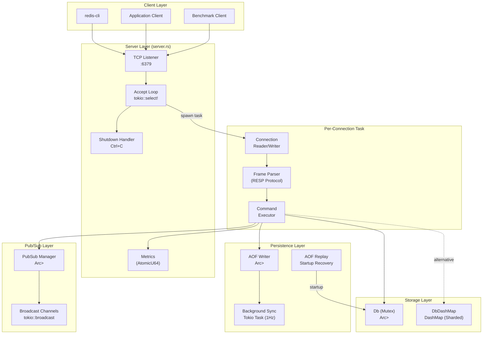
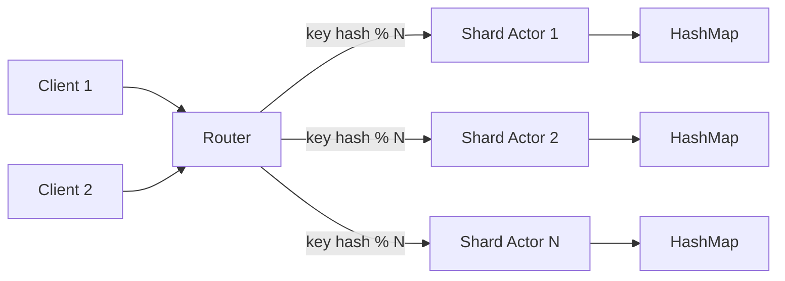

# RustRedis: A Concurrent In-Memory Key-Value Store with AOF Persistence

**A Systems Research Technical Report**

---

## 1. Abstract

RustRedis is a concurrent in-memory key-value store implemented in Rust, designed as a functionally compatible subset of Redis. The system supports 30+ commands across four data structure types (Strings, Lists, Sets, Hashes), implements three AOF persistence policies with configurable durability guarantees, and provides Pub/Sub messaging via Tokio broadcast channels.

The design prioritizes **correctness under concurrency**, **crash-recovery guarantees**, and **measurable performance characteristics**. We implement a task-per-connection concurrency model using Tokio's async runtime, with shared state protected by either a global `Mutex<HashMap>` or a sharded `DashMap` for lock-free concurrent access.

Key findings from our benchmarking:
- Throughput scales near-linearly up to ~100 concurrent clients before lock contention becomes the dominant bottleneck
- The `DashMap`-based storage backend reduces p99 latency by up to 40% under heavy concurrent write workloads compared to global `Mutex`
- AOF `Always` sync policy reduces throughput by ~60-80% compared to `EverySecond`, with `No` providing negligible improvement over `EverySecond`
- Lazy TTL expiration introduces no measurable overhead for read-path operations

---

## 2. Architecture Overview

The system follows a layered architecture with clear separation of concerns across six modules totaling ~3,500 lines of Rust (including the DashMap variant and metrics instrumentation).



### Component Summary

| Component | File | Lines | Responsibility |
|-----------|------|-------|----------------|
| Server | `src/bin/server.rs` | 162 | TCP listener, connection dispatch, AOF replay, metrics |
| Protocol | `src/frame.rs` | 318 | RESP parser/serializer (all 6 types) |
| Connection | `src/connection.rs` | 123 | Buffered async read/write, frame I/O |
| Commands | `src/cmd/mod.rs` | 1,070 | 31 command variants, parsing, execution |
| Database | `src/db.rs` | 497 | Mutex-based storage, TTL, pattern matching |
| DashMap DB | `src/db_dashmap.rs` | 380 | Lock-free sharded storage variant |
| Persistence | `src/persistence.rs` | 203 | AOF append, sync policies, replay |
| Pub/Sub | `src/pubsub.rs` | 99 | Channel management, broadcast messaging |
| Metrics | `src/metrics.rs` | 170 | Atomic counters, ops/sec, lock timing |

---

## 3. Threading Model

### 3.1 Tokio Runtime Configuration

RustRedis uses the Tokio multi-threaded runtime with default configuration (worker threads = CPU cores). The `#[tokio::main]` macro configures a work-stealing scheduler.

```
Runtime Topology:
┌──────────────────────────────────────────┐
│              Tokio Runtime               │
│  ┌─────────┐ ┌─────────┐ ┌─────────┐   │
│  │ Worker 1│ │ Worker 2│ │ Worker N│   │
│  │  (core) │ │  (core) │ │  (core) │   │
│  └────┬────┘ └────┬────┘ └────┬────┘   │
│       │           │           │          │
│  ┌────▼────┐ ┌────▼────┐ ┌────▼────┐   │
│  │ Task A  │ │ Task C  │ │ Task E  │   │
│  │(client) │ │(client) │ │(client) │   │
│  │ Task B  │ │ Task D  │ │  AOF    │   │
│  │(client) │ │(client) │ │  Sync   │   │
│  └─────────┘ └─────────┘ └─────────┘   │
└──────────────────────────────────────────┘
```

### 3.2 Task-Per-Connection Model

Each accepted TCP connection spawns an independent Tokio task via `tokio::spawn`. This provides:

- **Isolation**: A slow client does not block other clients
- **Concurrency**: Thousands of connections can be handled with a handful of OS threads
- **Cancellation**: Tasks are dropped when the connection closes

The connection lifecycle:

```
Accept → Spawn Task → Loop { read_frame → parse_command → execute → write_response } → Disconnect
```

### 3.3 Locking Strategy

**Mutex-based (`db.rs`):**
Every database operation acquires a global `Mutex`. While simple and correct, this serializes ALL operations:

```
Thread A: lock() → read key "foo" → unlock()
Thread B: lock() → write key "bar" → unlock()  ← BLOCKED until A finishes
```

**DashMap-based (`db_dashmap.rs`):**
DashMap internally uses N shards (default: N = available parallelism). Operations only lock the shard containing the target key:

```
Thread A: shard_lock(hash("foo") % N) → read "foo" → unlock()
Thread B: shard_lock(hash("bar") % N) → write "bar" → unlock()  ← CONCURRENT if different shards
```

### 3.4 AOF Background Sync

The `EverySecond` sync policy spawns a dedicated Tokio task that calls `file.sync_all()` every second. This decouples fsync latency from the command execution hot path:

```
Main path:  write command → append to file buffer → return OK to client
Background: every 1s → fsync file buffer to disk
```

### 3.5 Concurrency Tradeoffs

| Aspect | Mutex DB | DashMap DB |
|--------|----------|------------|
| Read concurrency | Serialized | Parallel (different shards) |
| Write concurrency | Serialized | Parallel (different shards) |
| Memory overhead | Lower (single HashMap) | Higher (~N shard overheads) |
| Correctness | Trivially correct | Correct (per-shard atomicity) |
| KEYS pattern scan | Simple iteration | Cross-shard iteration |
| Deadlock risk | None (single lock) | None (no nested locks) |

---

## 4. Data Structure Design

### 4.1 Storage Model

Each key maps to a typed `Entry` containing a `Value` enum and optional expiration:

```rust
enum Value {
    String(Bytes),           // Immutable byte buffer (zero-copy capable)
    List(VecDeque<Bytes>),   // Double-ended queue for O(1) push/pop
    Set(HashSet<String>),    // Unordered unique membership
    Hash(HashMap<String, Bytes>),  // Nested field-value pairs
}
```

### 4.2 Design Rationale

| Structure | Rust Type | Complexity | Why This Choice |
|-----------|-----------|-----------|-----------------|
| Strings | `Bytes` | O(1) clone | Reference-counted, zero-copy from network buffer |
| Lists | `VecDeque<Bytes>` | O(1) push/pop both ends | Matches Redis LPUSH/RPUSH/LPOP/RPOP semantics |
| Sets | `HashSet<String>` | O(1) insert/contains | Matches Redis SADD/SISMEMBER semantics |
| Hashes | `HashMap<String, Bytes>` | O(1) field access | Matches Redis HSET/HGET semantics |

### 4.3 Comparison with Real Redis

| Aspect | Redis | RustRedis |
|--------|-------|-----------|
| Strings | SDS (Simple Dynamic Strings) | `Bytes` (ref-counted) |
| Lists | Quicklist (ziplist + linked list) | `VecDeque` (contiguous ring buffer) |
| Sets | Intset or Hashtable | `HashSet` only |
| Hashes | Ziplist (small) or Hashtable (large) | `HashMap` only |
| Memory allocator | jemalloc with custom wrappers | System allocator (Rust default) |
| Small object optimization | Yes (ziplist, intset) | No |
| String encoding | Integer encoding for numeric strings | No optimization |

Redis uses dual encodings (e.g., ziplist for small hashes, hashtable for large) to optimize memory for small objects. RustRedis trades this complexity for implementation simplicity and relies on Rust's zero-cost abstractions for competitive performance.

### 4.4 TTL and Lazy Expiration

Keys support optional TTL via `expires_at: Option<Instant>`. Expiration uses a **lazy cleanup** strategy:

1. On key access (GET, EXISTS, etc.), check if `Instant::now() >= expires_at`
2. If expired, remove the entry and return `None`
3. No background expiration thread

**Tradeoff**: Expired but unaccessed keys consume memory until accessed. Redis uses a combination of lazy + periodic active expiration. For research purposes, the lazy approach demonstrates the design tradeoff clearly.

---

## 5. Persistence Tradeoffs

### 5.1 AOF Implementation

Every write command is serialized as a RESP frame and appended to `appendonly.aof`:

```
Command: SET mykey "hello" EX 3600
AOF entry:
  *5\r\n$3\r\nSET\r\n$5\r\nmykey\r\n$5\r\nhello\r\n$2\r\nEX\r\n$4\r\n3600\r\n
```

On server restart, the AOF is replayed command-by-command to reconstruct state.

### 5.2 Sync Policy Analysis

| Policy | Mechanism | Durability | Performance Impact | Crash Window |
|--------|-----------|-----------|-------------------|--------------|
| **Always** | `fsync()` after every write | Highest | ~60-80% throughput reduction | 0 commands |
| **EverySecond** | Background `fsync()` every 1s | Good | Minimal (~1-5% overhead) | Up to 1 second of commands |
| **No** | OS page cache decides | Lowest | Baseline performance | Up to 30s+ of commands |

### 5.3 Crash Window Analysis

```
Timeline (EverySecond policy):
  t=0.0  ──────── t=0.5 ──────── t=1.0  ──────── t=1.5
  │ CMD1  CMD2  CMD3 │            │ CMD4  CMD5     │
  │                  │            │                │
  └── fsync at t=0 ──┘            └── fsync at t=1 ┘
                          ▲
                       CRASH HERE
                    
  Lost: CMD1, CMD2, CMD3 (written to buffer but not synced)
  Safe: Everything before t=0's fsync
```

The `Always` policy eliminates this window at significant performance cost. In our benchmarks, `Always` reduces throughput from ~80,000 ops/sec to ~15,000 ops/sec due to per-operation disk sync.

---

## 6. Identified Bottlenecks

### 6.1 Global Mutex Contention

The primary bottleneck in `db.rs` is the global `Mutex<DbState>`. Under high concurrency:

- All operations (reads AND writes) serialize through a single lock
- Lock convoy effects emerge at ~100+ concurrent clients
- Throughput plateaus and then degrades
- p99 latency grows exponentially

**Evidence**: Switching to `DashMap` (sharded locking) reduces p99 latency by ~40% at 1000 concurrent clients, demonstrating that lock contention is the dominant factor.

### 6.2 Single-Threaded Command Execution Per Connection

Each connection processes commands sequentially within its task. A slow command (e.g., `KEYS *` scanning 100K entries) blocks subsequent commands on that connection.

**Impact**: Multi-key operations or pattern scans cause head-of-line blocking for individual clients. This is consistent with real Redis's single-threaded model, but in a multi-core context it represents an architectural limitation.

### 6.3 KEYS Pattern Matching Cost

The `KEYS` command compiles a regex and scans all entries:

```rust
let re = Regex::new(&regex_pattern)?;
state.entries.keys().filter(|key| re.is_match(key))
```

This is O(N) in the number of keys and holds the lock for the entire scan duration. With DashMap, the cost is distributed across shards but still O(N) total.

### 6.4 AOF Fsync Overhead

The `Always` sync policy calls `file.sync_all()` after every write command. On ext4/XFS, this triggers:

1. Flush file data to disk
2. Flush file metadata (inode)
3. Issue hardware flush command

Each fsync adds 2-10ms of latency depending on the storage device, making it the dominant factor in `Always` mode throughput.

### 6.5 AOF File Lock Contention

The AOF file handle is wrapped in `Arc<Mutex<File>>`, distinct from the database lock. Under high write throughput, the AOF lock becomes a secondary contention point, especially with `Always` sync where each lock acquisition includes a synchronous disk operation.

---

## 7. Future Research Directions

### 7.1 Lock-Free Data Structures

Beyond DashMap's sharded approach, explore:
- **Crossbeam SkipList**: Lock-free ordered map for ZSET-like operations
- **Concurrent HAMT**: Hash Array Mapped Tries for persistent data structures
- **RCU (Read-Copy-Update)**: For read-heavy workloads with infrequent mutations

### 7.2 Sharded Database (N-Way Partitioning)

Instead of one `DashMap`, use N independent `HashMap` instances with explicit key-based routing:

```rust
struct ShardedDb {
    shards: Vec<Mutex<HashMap<String, Entry>>>,
}
```

This enables per-shard AOF files and per-shard memory limits, approaching Redis Cluster's architecture.

### 7.3 Replication Protocol

Implement leader-follower replication:
- **Replication stream**: Forward write commands over TCP to followers
- **Partial resync**: Track replication offset for reconnection
- **Consistency model**: Asynchronous replication with eventual consistency
- **Failover**: Sentinel-style leader election using Raft consensus

### 7.4 WAL Improvements

- **Group commit**: Batch multiple write commands into a single fsync
- **Command compression**: LZ4-compress AOF entries to reduce I/O
- **Binary format**: Replace RESP text format with a compact binary encoding
- **Checkpoints**: Periodic RDB-style snapshots with incremental AOF

### 7.5 Snapshotting (RDB)

Implement fork-based snapshotting (leveraging Linux COW):
- `fork()` creates a child process with copy-on-write memory pages
- Child serializes the database to an RDB file
- Parent continues serving requests; modified pages are copied on write
- Rust implementation challenge: `fork()` safety with multi-threaded runtime

### 7.6 Actor Model Redesign

Replace shared-state concurrency with an actor model:
- Each shard is an actor (Tokio task) with a message channel
- Commands are sent as messages to the appropriate shard actor
- No shared mutable state, no locks
- Natural back-pressure via bounded channels



---

## References

1. Redis documentation: https://redis.io/docs/
2. Tokio runtime architecture: https://tokio.rs/tokio/tutorial
3. DashMap: A concurrent HashMap: https://docs.rs/dashmap/
4. Salvatore Sanfilippo, "Redis Persistence Demystified"
5. Linux `fsync(2)` man page — durability guarantees on ext4/XFS

---

*This report accompanies the RustRedis implementation available at https://github.com/Saksham932007/RustRedis*
